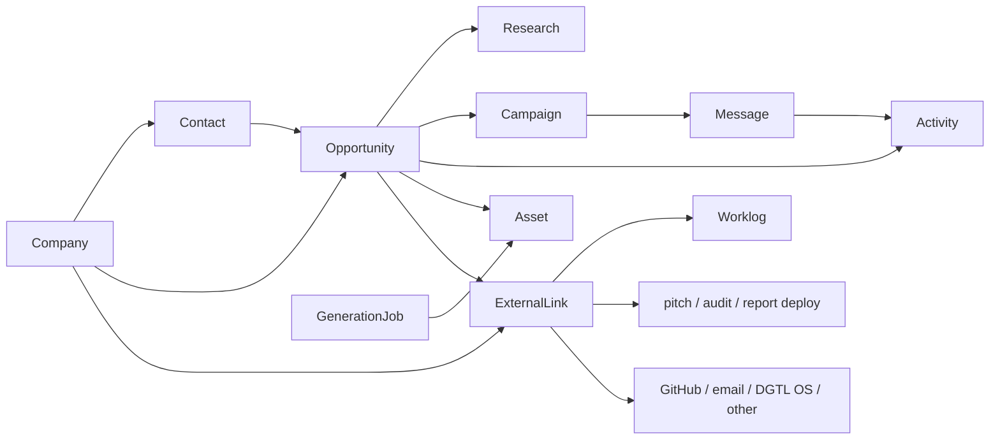

# DGTL Core Phase 1 architecture

**Status:** implemented on `codex/core-domain-phase-1`
**Date:** 2026-08-13
**Scope:** canonical commercial graph, integration primitives, and first routed workflow

## Outcome

DGTL Core is an additive module inside the existing Next.js platform. It does not replace the outreach engine, Worklog, pitch/audit/deploy systems, tenant funnels, or the legacy admin. It gives those systems a shared commercial graph and durable IDs:

The architecture is a modular monolith with adapters:

- `platform/lib/core/` owns Core IDs, relationship rules, duplicate matching, persistence interfaces, compatibility projections, and application services.
- PostgreSQL tables from `migrations/009_core_domain.sql` are canonical persistence.
- `LegacyCoreRepository` projects current leads, target accounts, account campaigns, draft emails, outreach queue/events, and calls into the same Core shapes.
- `CompositeCoreRepository` merges both sources by deterministic ID, with canonical rows winning. This keeps legacy writes visible before every old workflow is dual-written.
- Independently deployed systems are referenced by `external_links`; their domain data is not replicated.
- Artifact creation is represented by `generation_jobs`; the output is a separate `artifacts` record linked through `generation_job_artifacts`.

## Stable IDs and tenancy

New records use typed UUID-backed text IDs such as `company_<uuid>`, `contact_<uuid>`, and `opportunity_<uuid>`. Compatibility records use deterministic IDs such as:

- `company_lead_<lead_id>`
- `contact_lead_<lead_id>`
- `opportunity_lead_<lead_id>`
- `company_target_<target_account_id>`
- `opportunity_account_campaign_<account_campaign_id>`
- `campaign_outreach_<outreach_campaign_id>`
- `message_outreach_queue_<queue_id>`

All primary Core tables carry `team_id`; tenant-specific records also carry optional `tenant_id`. Every service read and relationship check is team-scoped. Database indexes begin with `team_id` where the primary access path is a tenant-isolated list.

Legacy data is backfilled one row at a time. Domain or email equality creates a duplicate candidate; it never causes an automatic merge. This intentionally preserves provenance and avoids destructive production-data changes.

## Entity decisions

### Company

`companies` is the canonical account/organization. It stores legal/display name, normalized domain, website, classification, location, source, owner, relationship status, summary, timestamps, import lineage, legacy lineage, and metadata.

`research_summary` is a convenience summary only. Sourced facts belong in `research_records`.

### Contact

`contacts.company_id` replaces repeated company fields on people. The entity stores names, role/title, email, phone, LinkedIn/social references, source, deliverability, consent, suppression, owner, timestamps, import lineage, and legacy lineage.

Deterministic duplicate candidates, in descending strength:

1. same team + normalized email;
2. same team + normalized phone;
3. same team + same company + normalized full name.

Every match requires review.

### Opportunity

`opportunities` is the canonical unit of a sales approach. One company can have many opportunities. Primary and additional contacts use `primary_contact_id` plus `opportunity_contacts`. It carries stage/status, value/currency, owner, structured qualification, approach angle, offer/entry offer, next action/date, source, timestamps, lineage, and metadata.

### Research

`research_records` requires a company and/or opportunity and retains source type/URL, content, structured signal data, capture time, author/agent, confidence, and verification status. Research imported from legacy records keeps its legacy ID and is marked unverified rather than being presented as independently verified fact.

### Campaign, Message, Activity

The canonical tables are `campaigns`, `messages`, and `activities`.

- Existing outreach campaigns and account campaigns are not rewritten. Outreach campaigns project/backfill to `campaigns`; account campaigns become opportunities because they describe a sales approach.
- Existing draft emails and queue rows project/backfill to `messages`.
- Outreach events and calls project into the activity stream. They are not copied in bulk during Phase 1, avoiding duplicate event histories while those subsystems remain authoritative writers.
- New Core activities are append-only business events. `audit_logs` remains the security/administrative audit trail and is not conflated with commercial activity.

### Artifact and GenerationJob

`artifacts` is a registry, not a binary/media store. It records kind, opportunity/company, generation job, slug, source path, build commit, deployment target/URL, version, approval, status, and timestamps. `media_assets` remains the tenant presentation-media library.

`generation_jobs` records the requested tool/skill, brief, creator, lifecycle times, result/error metadata, and company/opportunity. `generation_job_artifacts` supports one job producing multiple artifacts without embedding process history into the artifact.

### ExternalLink

`external_links` is a polymorphic cross-system reference: local type/ID, external system/object type/ID/URL, sync cursor/state, metadata, and timestamps. Phase 1 service validation permits Company, Contact, and Opportunity links; the table remains generic for later Campaign, Message, Artifact, and Job adapters.

No bidirectional field synchronization is introduced. Worklog remains authoritative for task/time data; the platform stores its external object identity and URL only.

## Old-to-new mapping

| Current source | Core destination | Phase 1 treatment | Long-term decision |
| --- | --- | --- | --- |
| `tenants` / `teams` | ownership context | Direct reuse | Keep |
| `leads` | Company + Contact + Opportunity; notes/enrichment → Research | Deterministic backfill plus live compatibility projection | Retire as a compound domain record after intake/outreach dual-write is complete |
| `target_accounts` | Company; dossier/signals → Research | Deterministic backfill plus live compatibility projection | Retire behind Company + Research after ABM workflows migrate |
| `target_accounts.buying_committee` | Contact + opportunity membership | Live compatibility projection; no destructive JSON extraction | Migrate through reviewed contact creation, then retire nested people JSON |
| `account_campaigns` | Opportunity | Deterministic backfill plus live compatibility projection | Retire after enterprise prospecting writes opportunities directly |
| `outreach_campaigns` | Campaign | Deterministic backfill plus live compatibility projection | Keep as outreach-engine compatibility storage until the engine writes canonical campaign IDs |
| `draft_emails` | Message | Deterministic backfill plus live compatibility projection | Retire once drafts are canonical messages |
| `outreach_queue` | Message | Deterministic backfill plus live compatibility projection | Keep as delivery queue infrastructure; stop treating it as the business message record |
| `outreach_events` | Activity | Live projection only | Keep as provider/workflow event log behind the Activity adapter |
| `calls` / `call_events` | Activity | Call summary projection | Keep as telephony subsystem records |
| `tasks` | ExternalLink to Worklog task when applicable | No replication in Phase 1 | Retire platform task ownership after Worklog bridge; retain only compatibility where telephony requires it |
| `audit_logs` | — | No mapping; separate security audit trail | Keep |
| `media_assets` | — | No mapping; presentation media is not a pitch/audit/report artifact | Keep |
| filesystem pitch/audit/report/deploy outputs | Artifact | Register on creation/deployment through adapters | Keep independently deployable systems |

## Routed workflow

The authenticated Core shell is available at:

- `/companies`
- `/companies/[id]`
- `/contacts`
- `/contacts/[id]`
- `/opportunities`
- `/opportunities/[id]`

Company detail proves Company → Contacts / Opportunities / Research / Assets / Activity / External Links. Opportunity detail proves the opportunity-centered operating view: company, stakeholders, angle, next action, research, artifacts, generation jobs, campaign/message references, activity, and external systems.

The existing `/admin` tabbed surface remains accessible from the Core shell. `/` remains the host-resolved compatibility root: claimed tenant domains render their funnel; unclaimed app hosts redirect to `/admin`. Replacing that behavior during a Core data-model change would risk tenant routing and is intentionally deferred.

No production dummy records are introduced. The UI renders actual canonical/compatibility records or explicit empty states; test data exists only in tests.

## Spreadsheet import contract

The import state machine is:

`upload → staging → map → normalize → detect duplicates → preview → approved import → enrichment`

### Staging contract

1. `import_batches` stores team/tenant, filename/checksum, state, mapping, counts, actor/approval/reversion timestamps, and metadata.
2. `import_rows` stores immutable raw row data, normalized data, validation errors, duplicate candidates, before-state snapshots, applied changes, imported entity IDs, and row state.
3. No canonical entity is changed before approval.
4. Duplicate matches are previewed with rule/strength and require an explicit resolution: create separate, link existing, or approved merge/update.
5. Approved import runs transactionally per batch or resumable chunk. Every created record carries `import_batch_id`; every affected row records the resulting stable IDs.
6. Enrichment starts only after the approved import commits, so external failures cannot invalidate the import.

### Column mapping

| Spreadsheet concept | Normalization | Canonical write |
| --- | --- | --- |
| company | trim; preserve legal/display distinction when mapped | `companies.display_name` / `legal_name` |
| contact | parse explicit first/last columns when available; otherwise preserve full value | `contacts.first_name`, `last_name`, `full_name` |
| email | trim + lowercase for matching; preserve supplied value | `contacts.email`, `normalized_email` |
| website | parse URL, lowercase hostname, remove `www` for matching | `companies.website_url`, `normalized_domain` |
| research | never append to an untraceable blob | one `research_records` row with source type `spreadsheet`, batch/row provenance, capture time, author, and verification state |
| approach angle | creates or updates only the reviewed opportunity for the row | `opportunities.approach_angle` |
| source | preserved on each created entity and research record | `source` / `source_type` plus batch metadata |

If a row has company/contact details but no explicit opportunity title, preview proposes an opportunity name derived from the company plus import context; the user must approve it. A company can be imported without an opportunity.

### Reversion semantics

Reversion is a compensating workflow, never an unreviewed delete:

- preview uses `before_state`, `applied_changes`, and `imported_entity_ids`;
- records created only by the batch and unchanged since approval are soft-transitioned to an `import_reverted` state;
- updates to pre-existing records are restored from before-state only if no later edit conflicts;
- conflicts are reported for manual resolution;
- `reverted_by`/`reverted_at` and a commercial Activity record preserve the audit trail.

## Compatibility and deployment

- Migration 009 must be applied with `npm run migrate` before canonical writes.
- Reads degrade to compatibility projections if the tables are absent, so deploying application code before the migration does not break the legacy admin.
- Canonical writes fail closed with a clear migration requirement when Core storage is unavailable; they never fall back to mutating compound legacy rows.
- Current APIs and sending routes are untouched.
- There is no Worklog, pitch, audit, report, deploy, GitHub, email-provider, or DGTL OS field replication in Phase 1.

## Phase 2 order

1. Apply migration 009 in staging; reconcile backfill counts and duplicate candidates before production.
2. Add reviewed spreadsheet importer using the documented staging/reversion contract.
3. Dual-write lead intake and enterprise prospecting into Company/Contact/Opportunity; backfill buying committees through review.
4. Make outreach consume canonical contact/opportunity IDs while retaining the delivery queue as infrastructure.
5. Add GenerationJob workers and Artifact registration adapters for pitch, audit, report, and deploy systems.
6. Add one-way ExternalLink adapters for Worklog and deployment systems; then GitHub and email providers.
7. Add permission policies and write UI/API endpoints for Core records, including duplicate-review queues.
8. Move `/` to an authenticated operating dashboard only after domain routing has a separately verified entry point.
9. Retire compatibility projections table by table after dual-write parity, reconciliation, and rollback windows pass.
