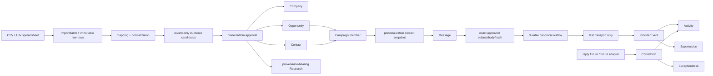

# DGTL Core Phase 2: import and outbound architecture

**Status:** implemented on `codex/import-outreach-phase-2`
**Date:** 2026-08-14
**Scope:** staged prospect imports, canonical campaign cohorts, immutable message approval, durable outbox, fail-closed provider/reply boundaries, and exception operations

## Implemented revenue path

Phase 2 is still a modular-monolith module. `platform/lib/stage2/` owns the workflow and PostgreSQL adapter; Phase 1's `CoreService` remains the sole constructor for Company, Contact, Opportunity, Research, and Activity. There is no competing CRM graph.

## Write and authorization boundary

New browser/API writes require an authenticated session. `team_id` always comes from the session, never from the request. A supplied tenant is checked with the existing team-to-tenant authorization before it reaches a service.

| Operation | Roles | Boundary |
| --- | --- | --- |
| upload/map/review import | owner, admin, sales | `ImportService` plus team-scoped repository |
| apply/reverse import | owner, admin | one database transaction |
| create campaign/cohort/drafts | owner, admin, sales | `OutreachService`; canonical relationship validation |
| approve campaign/message, queue, retry, suppress, resolve exception | owner, admin | exact server-side state transition |
| interactive outbox drain | owner, admin | server process; deterministic test transport only |
| provider event/reply fixture association | owner, admin | authenticated fixture API; not presented as a provider webhook |

Application-level authorization protects every new write path. Migration 010 adds `team_id` to `opportunity_contacts`; migration 011 extends composite team-aware constraints across the exposed Company, Contact, Opportunity, Campaign, Message, import, event, suppression, reply, and Activity relationships. The constraints are `NOT VALID`, so new rows are protected immediately and historical validation can be rehearsed without holding the deployment migration open. PostgreSQL RLS is not enabled; adopting RLS is a later defense-in-depth change and must include existing platform tables rather than covering only Stage 2.

Failures are fail-closed. Canonical writes require `DATABASE_URL` and migrations 009–011. An import apply uses a transaction; one invalid selected relationship rolls the whole batch back. No client can select a company/contact from another team because the selected IDs are resolved through team-scoped Core reads before use.

## Staged importer

The state machine is:

`upload → staging → map → normalize → detect duplicates → preview → approved import → enrichment`

Enrichment is intentionally only the next state contract; this phase does not start external enrichment automatically.

The upload route accepts UTF-8 CSV and TSV, capped at 8 MB and 10,000 rows. Excel workbooks must currently be exported to CSV/TSV; native `.xlsx` parsing is deferred so the production app does not acquire a large parser dependency without an explicit security/operational review.

`import_batches` retains filename, source type, SHA-256 checksum, uploader, team/tenant, mapping, counts, approval/reversion state, timestamps, and provenance metadata. `import_rows` retains source row number, raw values, normalized values, validation, candidates, decision, before-state, applied changes, and resulting IDs. `import_row_reviews` is append-only decision history.

### Column contract

Header suggestions are aliases, not a fixed schema. Users may remap any source header to the canonical fields.

| Input concept | Canonical destination |
| --- | --- |
| Company / Company Name | `Company.displayName` |
| Website / Domain | `Company.websiteUrl`, `normalizedDomain` |
| Industry / Category / Location | Company classification/location |
| Contact / First Name / Last Name | Contact names |
| Job Title / Role / Email / Phone / LinkedIn | Contact identity and communication fields |
| Recommended Approach Angle / Pitch Angle | `Opportunity.approachAngle` |
| Relevant Products / Offer Angle | `Opportunity.offer` |
| Priority / Opportunity Score | `Opportunity.qualification` |
| Research / Company Research | Research category `company_research` |
| Why DGTL Fits | Research category `fit_rationale` |
| Recent Signals | Research category `recent_signal` |
| Source / Source URL | Company/Opportunity source and Research provenance |

The raw cell is never overwritten. Normalization trims blank markers, cleans whitespace, lowercases match emails, normalizes hostnames/URLs, reduces phones to deterministic digits, maps common country names to codes, and derives first/last names only when explicit fields are absent.

### Duplicate rules and review

Company matching uses same-team normalized domain first, then normalized name plus location. Contact matching uses same-team normalized email, phone, then name within the selected company. States are `new`, `exact_match`, `probable_match`, `conflicting_data`, `invalid`, and `ignored`.

Every match remains reviewable. Decisions are `use_existing`, `create_new`, `merge_approved_fields`, `skip`, and `review_later`. A merge updates only explicitly approved fields. Ambiguous candidates never merge automatically.

### Apply and reversal

Approval creates or links Company and Contact, creates one Opportunity for the reviewed approach, emits separate Research records, and emits `prospect_imported` Activity. Every record and row retains batch/row lineage.

Reversal is compensating and conflict-safe, never `delete where import_batch_id = ...`. In the implemented conservative path, batch-created opportunities are closed at `import_reverted`, companies become inactive, contacts become suppressed, rows become `compensated`, and all stable IDs remain traceable. Existing matched records are not deleted. Restoring selected field-level merges from `before_state` after concurrent edits remains technical debt and is deliberately safer as a manual exception than an unconditional overwrite.

## Canonical campaign and message ownership

`campaign_members` connects each Campaign to a canonical Opportunity and Contact with a uniqueness constraint. The cohort cannot be a disconnected list of email strings. Imported and pre-existing canonical opportunities are selectable; import lineage is retained on the membership.

The personalization contract snapshots:

- Company identity, domain, industry/category, and location;
- Contact identity, title/role, and recipient email;
- Opportunity stage, approach angle, offer/entry offer, and qualification;
- sourced Research IDs, categories, content, source URL/type, capture time, and verification;
- Campaign instructions and sequence.

Rendering supports a deliberately small deterministic token surface. AI generation is not given generalized write authority.

Campaign lifecycle is `draft → review → approved`; cohort or rendered-message changes invalidate campaign approval. Message lifecycle is `draft → approved → queued → sent` with paused, review-required, suppression, uncertain-outcome, failure, and dead-letter branches. Approval stores exact sender, recipient, subject, body, SHA-256 envelope/content hash, actor, and time. Editing rendered content invalidates approval. A contact email or message envelope change after approval is held for review before delivery.

## Durable outbox and safety

Canonical `messages` now carry idempotency key, queue state, schedule/retry times, attempt count, bounded maximum attempts, lease owner/time, provider ID, failure/dead-letter/uncertain state, and the approved envelope/content. Workers serialize claim-capacity calculation per team with a transaction-scoped PostgreSQL advisory lock, then claim bounded due batches using `FOR UPDATE SKIP LOCKED`; finalization compares both queue state and lease owner so a stale worker cannot change a message it no longer owns. `message_delivery_attempts` records the attempt before the provider call and preserves the exact provider outcome afterward.

Retries use bounded exponential backoff. Exhaustion creates a dead-letter state and an `operation_exceptions` record. A lease that expires before an attempt begins is safely recoverable; a lease/provider timeout after delivery begins becomes `delivery_uncertain`, opens an exception, and is never automatically retried. An explicit retry adds one attempt; it does not start an unbounded loop.

The deterministic test adapter remains the default and makes no network calls. The existing Resend integration is available only through a fail-closed production adapter requiring five coordinated release/configuration gates, a configured API key, and reviewed rate policy. The Resend request carries the canonical idempotency key. Network/timeout ambiguity is quarantined rather than retried. No production gate is enabled by this branch and no commercial email was sent.

Provider-independent rate policy enforces team, sending-account, recipient-domain, batch, worker-concurrency, and bounded retry-backoff concepts. Defaults are deliberately conservative for test/staging; production values require a release-specific approval value.

## Suppression, events, and replies

`contact_suppressions` is the canonical durable suppression registry. Queue eligibility reads both it and the legacy `outreach_suppression_list`, so unsubscribe/hard-bounce/manual blocks survive future imports. An imported matching contact is marked suppressed, and every worker re-checks suppression immediately before delivery. Provider bounce, complaint, and rejection events create canonical suppression where applicable.

`provider_events` de-duplicates provider event IDs and associates by a team-owned Message/provider message ID. `/api/webhooks/resend` verifies the raw Svix-signed body, rejects stale/replayed signatures, derives the team from server-owned configuration, updates canonical delivery state, emits Activity, and applies suppression where appropriate. Unmatched signed events are retained as review exceptions. Full sensitive payloads are not copied by default.

The current platform has no deterministic production inbound-email webhook. Phase 2 therefore implements and tests association logic without inventing a mailbox: provider `In-Reply-To` wins; one unique sent message for the normalized sender is a fallback; ambiguity becomes `review_required` plus an exception. `/api/core/replies/associate` is an authenticated fixture/adapter boundary, not a public production webhook.

## Legacy compatibility decisions

| Legacy structure | Stage 2 decision |
| --- | --- |
| `leads` compound record | no import dual-write; remains authoritative only for legacy lead UI/workflows |
| legacy CSV lead import | preserved unchanged at `/api/admin/leads/import`; new `/imports` is canonical staged import |
| `outreach_campaigns` | legacy engine remains operational; new routed campaigns write canonical `campaigns` |
| `draft_emails` | unchanged compatibility source; new drafts write canonical `messages` |
| `outreach_queue` | unchanged legacy delivery infrastructure; canonical Stage 2 uses Message outbox columns, avoiding blind dual-write |
| `outreach_suppression_list` | read as a compatibility suppression source; canonical Stage 2 adds `contact_suppressions` |
| `outreach_events` | legacy projection remains; new provider/workflow events emit canonical Activity directly |
| Resend provider seam | reused through the canonical adapter; production remains disabled behind release-specific gates |

Canonical records win where the same stable ID exists. Phase 2 intentionally does not create two editable copies of imported prospects or campaign message state.

## Routes

- `/imports`, `/imports/new`, `/imports/[id]`
- `/campaigns`, `/campaigns/new`, `/campaigns/[id]`
- `/operations/outbox`, `/operations/exceptions`

The Phase 1 Company/Opportunity pages already read canonical Activity, Campaign, and Message relationships, so imported and outbound events appear in the same graph. `/admin` and all legacy routes remain available.

## Migration and recovery expectations

Migrations 010 and 011 are additive and follow 009. They contain no table drop or data delete. Apply to a backed-up staging database first, reconcile legacy/canonical counts, validate deferred team constraints, exercise one import and test campaign, then back up again before production. Migration files are ledgered by `schema_migrations`; they are not re-run by `npm run migrate` once recorded. Individual DDL uses `IF NOT EXISTS` or guarded constraints where practical.

Rollback of application code is safe because legacy routes/tables are untouched. Database rollback is forward-repair: leave additive tables/columns in place, restore the pre-migration snapshot only for a severe migration failure, and never drop Stage 2 tables after users have created lineage-bearing data.

## Phase 3 handoff

1. Create an authorized, isolated staging target and run this branch there with test transport only.
2. Add native `.xlsx` ingestion after dependency/security review and streaming large-file storage.
3. Finish conflict-aware field restoration for approved merges and expose before/after diff selection in the import UI.
4. Connect a real inbound mailbox/receiving webhook to the implemented deterministic reply-correlation boundary.
5. Migrate the legacy outreach cohort/send path to canonical Company/Contact/Opportunity/Message IDs first, then retire each legacy write path only after reconciliation.
6. Add PostgreSQL RLS as platform-wide defense in depth, not a Stage 2-only patch.
