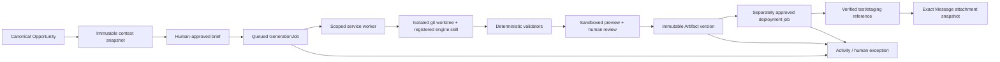

# DGTL Core Phase 3: controlled sales-asset automation

**Status:** implemented locally on `codex/artifact-automation-phase-3`

**Date:** 2026-08-14
**Scope:** bounded GenerationJob orchestration, immutable Artifact versions, isolated pitch generation, deterministic validation, review, test deployment, and exact Message attachment

## Implemented contract

Core never executes a shell from a browser request. It owns authorization, immutable inputs,
state, approval, Artifact identity, deployment intent, and history. A separately authenticated,
team-scoped worker claims a bounded job and executes a versioned adapter in a temporary detached Git
worktree. The worker only returns structured paths, validation, checksum, commit, preview, and error
metadata.

## Capability audit

| Capability | Existing generator | Deterministic validation | Output | Deployment surface | Stage 3 classification |
| --- | --- | --- | --- | --- | --- |
| Full pitch page | `engine/dgtl-pitch-pages` | manifest, registry, allow-list, relative links, repository links, SHA-256 | `pitches/<slug>/` + registry | `deploy/portal` → `pitch.dgtlmag.com` | **Complete path** via `pitch.pages`; production adapter disabled |
| Alternative full pitch | `engine/dgtl-pitch-composer` | same bounded pitch contract | `pitches/<slug>/` + registry | same pitch portal | registered for authorized agents; the local deterministic acceptance worker intentionally uses only `pitch.pages` |
| Pitch teaser | `engine/dgtl-pitch-teasers` | pitch manifest/path/link contract | `teaser.html` + pitch manifest | same pitch portal | registered follow-on capability; requires approved pitch Artifact; not the acceptance path |
| Digital audit | repository contains manual artifacts; installed `dgtl-client-audit` skill is outside `engine/` | no engine-owned deterministic generator contract | current `audits/` folders / PDF or HTML | `deploy/report-portal` → `audit.dgtl.report` | `installed_unavailable`; Artifact/job boundary only |
| Client report | installed `dgtl-client-reports` / Worklog report skill is outside `engine/` | no engine-owned generator contract | HTML/report bundle | `deploy/report-portal` → `dgtl.report` | generation `installed_unavailable`; hosting/deployment exist separately |
| Brand-kit asset | `engine/dgtl-brand-kit` | broad skill, no bounded Stage 3 path policy | caller-selected product files | none canonical | `disabled`; its arbitrary output surface is too broad |

The n8n agency spine can invoke a local autonomous agent with edit permissions, but it is not a
safe Core web execution boundary and is not used. Audit/report hosting does not imply automated
generation. No capability is advertised as supported merely because a finished artifact exists.

## Registry and immutable context

`platform/lib/stage3/registry.js` is a capability registry, not a duplicate skill definition. Each
adapter records skill identity, `engine/` source directory, workflow version, artifact kinds,
required context, allowed paths, validators, execution mode, preview/deployment support, and one of
`supported`, `installed_unavailable`, or `disabled`.

The job snapshots Company identity/classification, Opportunity qualification/approach/offer,
stakeholders, selected Research with source/timestamp/confidence/verification, optional Campaign
positioning, and the approved brief/CTA. Research is explicitly classified as verified research,
imported unverified note, unverified research, or agent inference. Opportunity strategy remains
strategy; it is never silently promoted to fact. Later CRM edits do not rewrite the snapshot.

## State and approval

The supported progression is:

`draft → queued → claimed → running/validating → awaiting_review → approved → deploy_queued → deploying → deployed`

Terminal or intervention states are `failed`, `validation_failed`, `rejected`, `cancelled`, and
`deployment_failed`; an uncertain deployment is quarantined as `outcome_unknown` on the deployment
record. The input brief, generated result, Artifact, and deployment are distinct approval points.
Sales may request, inspect, and request revisions. Owners/admins approve Artifact versions and
deployment. The service rejects a generator approving its own output.

An approved Artifact is immutable. A revision creates a new GenerationJob and Artifact version with
`previous_version_id`; it never overwrites the old source/checksum. Slugs are reserved per team,
kind, and family. A second non-revision request for the same slug fails deterministically.

## Isolated execution and validation

The `pitch.pages` acceptance worker:

1. creates a detached temporary Git worktree at the job's source commit;
2. copies and personalizes the real `pitches/_templates/website-overhaul.html` workflow by declared
   `data-slot` values;
3. writes only `pitches/<slug>/**` and `pitches/pitches.index.json`;
4. captures all changed paths and the diff stat;
5. checks manifest, registry, required HTML, relative-link policy, no unexpected paths, and
   `tools/check-links.py` with `missing=0`;
6. computes a SHA-256 over the exact output and commits the candidate inside the isolated worktree;
7. submits the structured result through the scoped worker API.

Traversal, absolute paths, null bytes, unrelated source/config edits, unknown adapters, and slug
collisions are rejected. Actual modifications are derived independently from Git status rather than
trusted from the worker's declared manifest; generated source and preview inputs must be regular,
non-symlink files. A validation failure cannot become an Artifact. Generated HTML is copied
by the worker into a fixed local/staging preview root using a hash of the server-owned team/job
identity. An authenticated route can read only that derived file, only for a validated same-team
job, and responds with a restrictive CSP. The UI embeds it in an iframe with an empty sandbox
permission set. Worker-supplied preview references must be that exact route or HTTPS; script and
insecure schemes are rejected.

## Schema and security

Migration `012_artifact_automation_phase_3.sql` is additive. It adds `artifact_families`,
`artifact_deployments`, and `message_artifacts`; extends `generation_jobs` with snapshots,
adapter/version/source identity, claim/lease/result fields; and extends `artifacts` with immutable
family/version/checksum/approval metadata. Team-scoped indexes support queue claims and lookups.

Application routes derive `team_id` from authenticated sessions. Worker routes derive both team and
worker identity from server-owned bearer-token configuration. Request input cannot select a team.
Composite team foreign keys protect new GenerationJob/Artifact/family/deployment/Message links at
the database boundary. They are `NOT VALID` to avoid a production migration scan; historical
validation is a staging promotion gate.

## Deployment and Message attachment

Only `pitch.local-preview` is enabled. `pitch.portal` and `report.portal` describe the real
token-authenticated HTTP boundaries but remain disabled in the registry. The browser API hardcodes
`productionAuthorized: false`, and even an internal true flag cannot enable a disabled adapter.
Production needs a later reviewed adapter enablement, a separate approval record, scoped secret
delivery to the worker, checksum verification, and target health verification.

`message_artifacts` stores Artifact ID, version, kind/title, deployment URL snapshot, checksum, and
attachment actor/time. Attaching an Artifact resets the Message to draft and clears its previous
content/envelope approval. Creating v2 cannot alter a Message pinned to v1.

## Acceptance evidence

The disposable PostgreSQL 16 rehearsal applied migrations 001–012, reconciled seeded legacy data,
repeated 009–012 without count drift, and blocked direct cross-team Core and Artifact-family writes.
The end-to-end fixture used one Company, Contact, Opportunity, verified Research record, approach,
offer, and canonical Message. It generated and committed pitch v1 and a distinct revision v2 in
separate temporary worktrees. Both passed repository link validation. The Message remained linked
to v1 and returned to draft. Duplicate result submission was rejected. Two Artifacts and thirteen
canonical Activities were recorded. The authenticated preview route served the 29 KB generated v1
HTML inside the sandboxed iframe. The deployment URL used `preview.invalid`; no production
asset, external email, DNS, live database, or deployment credential was touched.

Final local gates passed 16/16 focused Stage 3 tests, 423/423 complete platform tests, a 57/57-page
production build, the 001–012 repeat migration rehearsal, JSON/link/roster/compliance checks,
Worklog 375/375, creator intake 26/26, and a zero-vulnerability production dependency audit.

## Deferred work

- Implement a continuously operated generation worker and test its health/lease telemetry in a real
  staging environment; Stage 3 provides the scoped protocol and worker library, not a production daemon.
- Promote audit/report skills into versioned `engine/` sources with deterministic validators before
  marking those adapters supported.
- Wrap the real deploy portals with scoped, checksum-verifying workers; never expose their tokens to
  Core browser/API processes.
- Validate every deferred composite foreign key against a fresh production snapshot before promotion.
- Add Artifact retirement/revocation controls and deployed-content rollback semantics.
- Add PostgreSQL RLS as platform-wide defense in depth after the application-level migration settles.
