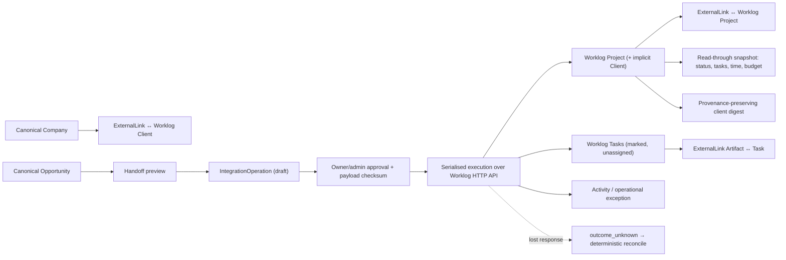

# DGTL Core Phase 4: Worklog delivery operations bridge

**Status:** implemented locally on `claude/dgtl-core-stage-4-95myaw`
**Date:** 2026-08-14
**Scope:** approved, idempotent Company→Worklog Client and Opportunity→Worklog Project handoff, bounded delivery-task creation, and read-through delivery status — with Worklog remaining the only authority for clients, projects, tasks, time, shifts, budgets, and execution state

## Implemented contract

Core owns intent, approval, idempotency, link identity, snapshots, and history. Worklog owns the
execution data. Core never opens the Worklog SQLite database and never replicates an editable copy
of any Worklog record.

## Worklog capability audit (what shaped the design)

Audited from `apps/worklog/server/api.mjs` (39 routes), not from the MCP description:

| Capability | Worklog API | MCP (before) | Core need | Stage 4 action |
| --- | --- | --- | --- | --- |
| List clients | `GET /api/clients` (projects>0 only) | absent | yes | connector read; MCP tool added |
| Create client | **does not exist** — clients materialise from a project's `clientName` and are pruned with their last project | absent | conditional | declared unsupported; documented side effect of `project.create` |
| List projects | `GET /api/projects` (no by-id route) | yes | yes | connector read |
| Create project | `POST /api/projects` (**admin**) | yes (admin) | yes | approval-gated IntegrationOperation |
| List tasks | `GET /api/tasks` | yes | yes | connector read |
| Create tasks | `POST /api/tasks` (assignee defaults to caller) | yes | yes | approval-gated, serialized, marker-tagged, `assigneeId: null` preserved |
| Update tasks | `PATCH /api/tasks/:id` (any user, any task) | yes | limited | not exposed through Core (Worklog ownership preserved) |
| Read project hours/budget | project rows carry `loggedMinutes`, `billableMinutes`, `budgetMinutes` | yes | yes | read-through snapshot |
| Read shifts | `GET /api/shifts`, `GET /api/shift/:id` | absent | later (HOME) | classified only; not built |
| Client digest | `GET /api/digest?clientId` with full row-level provenance | absent | yes | read-through pass-through; MCP tool added |
| Log time | `POST /api/entries` | yes | no (Stage 4) | untouched; Core never writes time |
| Timer control | `/api/timer/*` (per-user only) | absent | future DGTL OS | classified only |
| Idempotency/external refs | **none anywhere** — no unique project/task names, no metadata columns | — | critical | Core-side keys + deterministic markers (below) |
| Auth | cookie session only (no tokens); login throttle 10 per 15 min per ip+email | yes | yes | shared client; single 401 re-auth; no retry loops |

## One shared HTTP client

`apps/worklog/client/worklog-client.mjs` is now the single implementation of the Worklog HTTP
contract: cookie login with concurrent-login collapsing, exactly one re-auth per 401 (sessions are
revoked server-side on password change or deactivation), 429 surfaced and never retried, requests
serialised with a 120 ms minimum gap for the Passenger shared-hosting cap, `redirect: "manual"`,
no `Origin` header (Worklog's same-origin write guard passes origin-less requests), and credentials
that never reach a log line or error string. `apps/worklog-mcp/lib/client.js` is a thin wrapper
adding the MCP's `.env` fallbacks and production default URL; the platform imports the shared
module directly. Core does not spawn the MCP stdio process.

## Connector and configuration

`platform/lib/stage4/registry.js` declares the connector — reads, consequential actions, declared
unsupported operations with reasons, and the rate policy. `platform/lib/stage4/worklogConnector.js`
wraps the shared client behind cached, coalescing reads (30 s TTL, force-refresh on demand,
invalidated on writes) and classifies health as `unconfigured`, `connected`, `auth_failed`,
`insufficient_permission`, `throttled`, `unreachable`, or `degraded`.

Configuration is server environment only: `CORE_WORKLOG_BASE_URL` (no default — production is never
an implicit target), `CORE_WORKLOG_EMAIL` / `CORE_WORKLOG_PASSWORD` (a dedicated integration
account), and `CORE_WORKLOG_TEAM_ID` (the one Core team the connector serves, the same server-owned
team binding as the Stage 3 worker; unset fails closed for every team). No request input can select
an endpoint, so the connector cannot become an SSRF proxy, and no credential is ever serialised to
a browser.

## IntegrationOperation

Migration `013_worklog_operations_phase_4.sql` adds `integration_operations`, modelled on
`artifact_deployments` and deliberately not overloading `generation_jobs`: connector, action, local
entity, immutable payload snapshot, `payload_checksum` written at approval, team-unique
`idempotency_key`, requester/approver identities, attempt count, external result identity, result
and error metadata, and `uncertain_at`. States: `draft → approved → executing → succeeded`, with
`failed`, `cancelled`, and the `outcome_unknown` quarantine. Every transition is a compare-and-swap
(`… where status = any(expected)`), the same mechanic as Stage 3.

Classification follows Stage 3's model: reads execute immediately for any authenticated session;
previews (handoff preview, match candidates) have no external effect; consequential actions
(`project.create`, `tasks.create`) require a requested draft (owner/admin/sales), a distinct
owner/admin approval that checksums the exact payload, and an explicit execution. Changing the
payload after approval invalidates the approval (the operation is cancelled). Executing re-verifies
both the Core role and the Worklog identity's own permission (`project.create` requires the
integration account to be a Worklog admin) — Core never grants itself what Worklog would reject.

## Idempotency contract with Worklog

Worklog has no idempotency keys, no external-reference columns, and no unique constraint on project
or task names. The Stage 4 guarantee is therefore built entirely on the Core side:

1. **Request dedupe** — the idempotency key is a SHA-256 over connector, action, local entity, and
   the canonical payload; an identical request returns the existing operation (unique per team in
   the database).
2. **Deterministic external markers** — a created project carries a code derived from
   team+opportunity (`C4-XXXXXXXX`); every created task's notes end with `[core:<operationId>#<index>]`.
3. **Read-before-write** — execution re-reads Worklog first: a project with the operation's code is
   adopted (crash recovery); an exact name+client match *without* the code fails closed as
   `worklog_ambiguous_project_match` ("link it explicitly instead").
4. **Progress durability** — bulk task creation is serialized and records each created task id into
   `result_metadata` as it lands, so a resume skips completed items and re-checks markers.
5. **Unknown outcomes are quarantined, never retried** — a lost response after the write was sent
   becomes `outcome_unknown` + an exception. `reconcile` re-reads Worklog: marker found → adopt
   (no duplicate); provably absent → the operation returns to `approved` for one explicit re-run.
   A transient failure before any write returns the operation to `approved` without an exception.

The exact guarantee: **a retried or replayed request can never create a second Worklog project or
task for the same approved operation, and an uncertain outcome requires deterministic
reconciliation before any re-run is possible.**

## ExternalLink model

The existing `external_links` table remains the mapping; 013 adds lifecycle columns only
(`linked_by/at`, `last_verified_at/state`, `status_snapshot`, `snapshot_at`, `link_history`) plus a
system/object index and `(id, team_id)` uniqueness. Permitted Worklog mappings are Company↔client,
Opportunity↔project, and Artifact↔task; anything else is rejected. The unique key
(team, local entity, system, object type, external id) is the identity of a relationship: unlink
retires the row (the Worklog object is untouched), relink revives the same row, and every
transition appends to `link_history`. Repair never silently repoints — the user names the
replacement, Core verifies it exists, retires the old row, and records both sides. Because Worklog
prunes clients with no projects, client ids are treated as non-durable and links verify by fresh
lookup, surfacing `missing` rather than guessing.

One Worklog project can be claimed by only one opportunity; a conflicting claim is refused
explicitly. A project link whose client conflicts with the company's client link fails with
`worklog_client_mismatch` and an exception instead of silently rewiring either side.

## Matching

`matchCompanyClients` / `matchOpportunityProjects` return `linked`, `probable_match` (exactly one
exact case-insensitive name match), `candidate`, `multiple_candidates`, or `no_match`, with the
candidate list and freshness time. Matching only ever *presents*; a human explicitly picks the
candidate. Core never links on a guessed name.

## Read-through, time, shifts, digest

`refreshOpportunityDelivery` reads projects + tasks + bootstrap (for Worklog's own `today`),
persists a snapshot onto the link (`source: "worklog"`, `fetchedAt`), and shows project state,
open/overdue/done task counts, logged and billable minutes, budget and budget-used percentage —
all Worklog-provided figures, with the only derivations being counts over Worklog rows and the
same logged/budget percentage the Worklog UI computes. Pages render from the stored snapshot
(never calling Worklog on page render); candidate search and refresh are explicit user actions,
so dashboards cannot generate request storms. When Worklog is unavailable the last snapshot is
shown with its timestamp; `no link`, `stale`, and `missing` are distinct states.

Time: Worklog remains the only time ledger. Core reads project totals from project rows and
range-scoped, per-project breakdowns from the digest — it never recomputes billable logic and
never writes or edits time entries. Timer control and time logging stay in Worklog and its MCP.

Shifts: audited and classified for later HOME use (`currently clocked in`, today's shift,
reconciliation state via `GET /api/shifts` / `GET /api/shift/:id`); deliberately not exposed in
Stage 4.

Digest: `companyDigest` passes `GET /api/digest` through verbatim for the linked client — including
its `provenance` rows naming the exact entry/task ids behind every figure — stamped with source and
fetch time. No derived statement is separated from its provenance.

## Activity and exceptions

Meaningful events append canonical Activity: `worklog_client_linked`, `worklog_project_linked`,
`worklog_project_created`, `worklog_tasks_created`, `worklog_client_unlinked`,
`worklog_project_unlinked`, `worklog_link_repaired`, and the observed transitions
`worklog_project_archived` and `worklog_task_completed`. Transition detection is snapshot-diff
based and emits exactly once; a task already done before Core's first task observation is history,
not a transition, and repeated reads never duplicate Activity. Failures route into the existing
`operation_exceptions` desk: `worklog_auth_failed`, `worklog_permission_denied`,
`worklog_operation_rejected`, `worklog_operation_outcome_unknown`,
`worklog_ambiguous_project_match`, `worklog_client_mismatch`, `worklog_stale_external_link`.
Transient unreachability is not an exception until an operator needs to act.

## UI

`/operations/worklog` shows connection health (state, identity, capability list, last
success/error), the delivery-handoff queue (won/delivery-ready opportunities without a project
link, with `won`/`delivery` stages treated as delivery-ready), pending operations with
approve/execute/cancel/reconcile/retry forms, linked projects/clients, execution attention
(overdue snapshots, broken links), and open Worklog exceptions. Company detail gains a Worklog
panel (link state, explicit candidate search, repair/unlink with typed confirmation); Opportunity
detail gains the delivery panel (handoff preview with the deterministic project code and
will-create-client notice, link-existing with candidates, status snapshot with freshness, task
handoff drafting with approved-artifact references, refresh, repair/unlink). All server-rendered
form-post UI in the existing Core idiom; no Worklog credential or URL input exists in any form.

## Artifact → delivery

A task handoff item may reference an approved Artifact; the task notes carry the exact slug,
version, checksum prefix, and deployment URL, and an Artifact↔task ExternalLink pins the version.
A later Artifact v2 cannot change a task that references v1.

## Security posture (tested)

Cross-team access to companies, opportunities, operations, and links is rejected (service-level
team scoping plus the connector's own team binding). Approval-role separation is enforced twice
(route + service). Payload tampering after approval cancels the operation. Idempotency keys bind
to exact payloads — a changed payload is a new operation, not a reuse. The connector endpoint and
credentials are server-owned; stage-4 tests assert no `node:sqlite`/`DB_PATH` usage anywhere in
the bridge and no credential shape in any UI-bound payload.

## Acceptance evidence

`npm run rehearse:stage4` (CI: "Rehearse delivery handoff against a real local Worklog instance")
boots a **real Worklog server** (`server/server.mjs`, Node 22 `node:sqlite`) on a throwaway
database with a bootstrap admin, refuses non-localhost targets, and drives the whole path over the
real HTTP API against disposable PostgreSQL with migrations 001–013: match → approved project
handoff (client created as a declared side effect) → duplicate-request and repeat-execution
prevention proven through Worklog's own API → approved 3-task handoff with an exact artifact
reference, arriving unassigned → a real Worklog member completes a task and logs 180 minutes →
Core reads through status/time/budget (15% budget used) → exactly one observed-completion
Activity across repeated reads → provenance-backed digest (13 provenance rows) → healthy
operations overview. Failure catalogue exercised: ambiguous name fails closed; explicit
link-existing; conflicting claim refused; simulated lost response reconciled by marker adoption
with no duplicate; archived and deleted external projects detected (`archived` → `missing` +
one stale-link exception) and explicitly repaired; wrong credentials → `auth_failed` (single
probe); dead endpoint → `unreachable`; member integration identity denied project creation with
an exception; foreign team rejected; tampered payload invalidated. The Worklog export confirms
every change arrived as an authenticated Worklog user over HTTP.

## Production setup (later, deliberate)

1. Create a dedicated Worklog integration account on `office.dgtl.at` (admin role if project
   creation is wanted; member for task handoff only). Do not reuse a person's login.
2. Set `CORE_WORKLOG_BASE_URL=https://office.dgtl.at`, the account credentials, and
   `CORE_WORKLOG_TEAM_ID` on the Core server only.
3. Remember Worklog revokes sessions on password change — rotate the env var in step.
4. The connector's serialized, cached read policy is sized for the Hostinger/Passenger cap; do
   not raise concurrency without moving Worklog to a VPS first.

## Deferred

- Shift/attendance read-through for DGTL HOME (classified, not built).
- Task update/complete actions through Core (Worklog remains the editor).
- Digest snapshots as GenerationJob context for DGTL.report artifacts.
- MCP connector-health tool and Core-side Worklog webhook/event feed (Worklog is pull-only today;
  no fake cursors were invented).
- PostgreSQL RLS platform-wide (unchanged from Stage 1–3).
