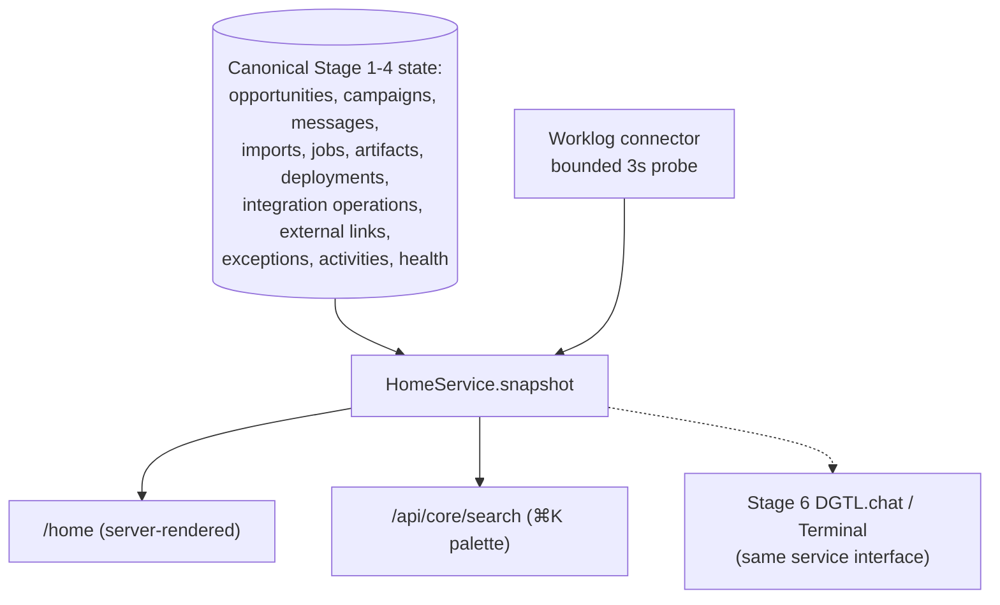

# DGTL Core Phase 5: HOME command center

**Status:** implemented locally on `codex/home-command-center-phase-5`
**Date:** 2026-08-14
**Scope:** one authenticated operating surface (`/home`) answering, in priority order: what needs
attention, what happens today, what is moving through sales, what is being delivered, what waits
for approval, what is unhealthy, and what happened recently — as a pure projection over the
canonical Stage 1–4 systems.

## Architecture

`platform/lib/stage5/` holds the whole layer: `repository.js` (read-only aggregation SELECTs),
`memoryRepository.js`, `homeService.js` (`HomeService.snapshot()` and `search()`), `server.js`
(page context). **No migration exists for Stage 5** — no notifications table, no dashboard state,
no persisted KPI. The rehearsal asserts no `notification|dashboard|home_` table exists.

## Source of truth per section

| Section | Source | Freshness |
| --- | --- | --- |
| Needs attention | Derived live from every source below | live DB (Worklog parts stamped) |
| Today | Opportunity `next_action_at`, approval queue, Worklog snapshot overdue tasks | live + snapshot |
| Approvals | campaigns `approval_state='review'`, messages `status='draft'`, jobs `draft`/`awaiting_review`, integration operations `draft`/`approved`, import batches `staged/mapped/review` | live DB |
| Pipeline | `count opportunities group by stage` (real stage vocabulary, `status <> 'closed'`) | live DB |
| Outreach | `count messages group by queue_state,status` + campaigns + Stage 2 health | live DB |
| Delivery | Stage 4 `external_links` status snapshots + integration operations | **snapshotAt shown**; never a live Worklog call |
| Generation | generation jobs / artifacts / deployments by status | live DB |
| System status | `getOperationalHealth`, transport gates, bounded Worklog probe | probe `checkedAt` shown |
| Recent activity | new `listTeamActivities` over canonical `activities` | live DB |

New repository reads (the only additions): `listTeamActivities` (team-wide, `occurred_at desc`,
capped), `countOpportunitiesByStage` (with known-value sum and unknown-value count — a missing
estimate is never presented as $0), `countMessagesByQueueState`, `listMessagesByStatus` (bounded),
and `searchEntities` (bounded ILIKE per kind). Everything else reuses Stage 1–4 methods through
`PostgresStage5Repository extends PostgresStage4Repository`.

## Attention model

`AttentionItem = { key, source, severity, title, explanation, entityType, entityId, href, at,
dueDate, actionCategory, recommendedAction }`. Keys are deterministic (`handoff:<oppId>`,
`exception:<id>`, `next-action:<oppId>`…), so an item is stable across renders and vanishes when
its source state resolves. There is deliberately no dismiss/snooze/notification persistence.

**Priority rules (documented, no scoring):** severity classes never interleave —
`critical` (dead letters, delivery-uncertain, deployment/operation `outcome_unknown` or failed,
failed imports, failed/validation-failed jobs, missing Worklog links, a failing connector) →
`action_required` (every approval item, open exceptions, delivery-ready-but-unlinked
opportunities, overdue next actions) → `due_today` (next actions due today, snapshot-reported
overdue Worklog tasks) → `upcoming` (next actions within 7 days) → `informational`. Within a
class: oldest timestamp first, then key. A user can always say why an item is ranked where it is.

## Approvals, roles

One cross-system queue; every row deep-links to the authoritative review surface (campaign page,
generation job, opportunity panel, import). HOME renders **no inline approval controls**, so no
role can see an enabled control it cannot use; `canApprove` (owner/admin) only changes the
explanatory copy, and viewers/contractors lose write-entry quick actions (`canWrite` filter).
All roles that can view the dashboard can view HOME (same `canViewDashboard` gate as every core
page).

## Search / ⌘K

`CommandPalette.jsx` (the second client component in Core) opens with ⌘K/Ctrl+K and calls
`GET /api/core/search?q=` — `requireSession`, team from the session only, two-character minimum,
per-kind caps, ≤30 results, `{kind, id, title, subtitle, status, href}`. Kinds: company, contact,
opportunity, campaign, artifact, generation job, linked Worklog project. No client-side dataset,
no AI advertised, nothing consequential executes from the palette. Stage 6 reuses both the
trigger surface and `HomeService.search()`.

## Routing decision

`app/page.jsx` stays host-resolved: a host claimed by an active tenant's `domains` list renders
its funnel exactly as before; the only change is the unclaimed-host redirect target, `/admin` →
`/home` (a relative redirect; tenant hosts never reach that line). `/home` lives in the `(core)`
group, so authentication and the team gate are inherited; unauthenticated visitors land on
`/admin/login` as before. Regression tests pin both branches by source assertion, and the
existing no-tenant-claims-the-app-host test still guards the host list.

## Navigation

The sidebar is grouped — HOME, GROW (Companies, Contacts, Opportunities, Imports, Campaigns),
CREATE (Generation, Artifacts), OPERATE (Worklog, Operations) — with the existing
`.core-nav-label` styling and the legacy admin link untouched. Mobile keeps a single bottom
strip: groups flatten (`display: contents`), the grid is count-agnostic, and six primary
destinations show (Home, Companies, Opportunities, Campaigns, Worklog, Operations); the rest are
desktop-only and remain reachable by search and deep links.

## Performance and failure behavior

One server-side `snapshot()` per render: ~15 bounded reads via `Promise.allSettled` (three are
SQL aggregates), zero browser fan-out, no N+1 (no per-entity graph calls). Worklog is **never**
called for card data — delivery uses stored Stage 4 snapshots with `snapshotAt` displayed — and
the single connector health probe is coalesced (30 s cache) and raced against a 3 s timeout. A
failing source degrades only the sections that need it (`state: "degraded"` with the reason);
everything else renders. Tested: a hung Worklog client leaves pipeline/delivery/outreach/activity
intact, and a failing campaigns read degrades approvals/outreach only.

## Security posture (tested)

Cross-team isolation for every section and for search (a foreign team's objects are invisible,
not just unlinkable); team is derived from the session in the search route and page context;
role-gated quick actions; no credential shape in HOME or palette output; tenant/public hosts
cannot reach HOME's data (separate route, authenticated context); health surfaces expose no
secrets (asserted in the Stage 2 gate already).

## Acceptance evidence

`npm run rehearse:stage5` (CI: "Rehearse HOME as a projection over canonical Stage 1-4 state")
builds a disposable PostgreSQL 001–013 environment plus a **real local Worklog**, then drives
legitimate flows: canonical company/contact/opportunities, a real Stage 2 campaign with drafted
messages (`review` state), a Stage 3 brief awaiting input approval, a real Stage 4 handoff
operation, and an operational exception. HOME recognized all six attention conditions with
correct deep links, reported known pipeline value (CAD 15,000) with unknown values counted
separately, then — after approving/executing the handoff (creating the real Worklog project),
approving the campaign, resolving the exception, and rescheduling the follow-up — the snapshot
dropped from 6 attention items to 2, delivery appeared with freshness, the connector reported
healthy, and Activity carried the handoff. Search found canonical records and returned nothing
for a foreign team. `information_schema` confirmed no dashboard/notification table exists.

## Stage 6 seam

DGTL.chat / Terminal consumes the same interfaces, never dashboard HTML:
`HomeService.snapshot()` (or its per-section builders), `HomeService.search(q)`,
`WorklogOperationsService.*`, `OutreachService.*`, `ArtifactAutomationService.*` — all
team-scoped, role-checked services. The ⌘K surface is the natural conversational entry point;
consequential actions must keep flowing through the existing approval services.

## Deferred

- Calendar events in Today (the item shape is ready; no fake calendar card shipped).
- Dismiss/snooze/reminders (only if operational use proves persistence is needed).
- Attention pagination beyond the fold-marker if item volume grows.
- Legacy-merged opportunity projections on HOME (HOME reads canonical-only via the Stage 4/5
  repository chain; legacy compatibility rows remain visible on the entity pages that merge them).
