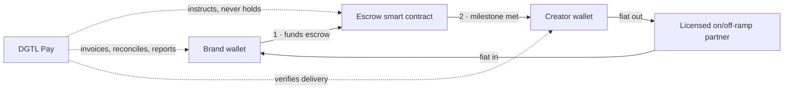

> **SUPERSEDED — archived v2.** This document is the dual-rail architecture and staged token. It is replaced in full by
> [`docs/DGTL-Pay-Strategy-v4.md`](../DGTL-Pay-Strategy-v4.md), which is canonical.
> Kept for reference only — do not act on anything below without checking it against v4.

---

# DGTL Pay + $DGTL — Strategy v2

**Supersedes:** DGTL-Token-Strategy.md
**Status:** working document · July 2026
**One line:** *USDC moves the money. $DGTL unlocks the network.*

---

## 0 · What changed from v1, and why

V1 got the architecture right and the sequencing wrong. It described a dual-rail system and then implicitly treated both rails as launching together. The council ruled otherwise.

| V1 said | V2 says | Why |
|---|---|---|
| Dual-rail: USDC + $DGTL | Same architecture, **staged**. Rail ships first; token is a dated, unminted roadmap phase | A rail is reversible. A token with holders is not. |
| Base first, Solana second | Unchanged — but the *rail* doesn't need a chain decision on day one | Circle + USDC works on both. Chain choice is a Phase 2 decision, not a Phase 1 blocker. |
| Token used for access, rebates, discounts | Same list — but each item now has to answer **"why can't this be a database balance?"** | First Principles was right that most of the list doesn't need a bearer token. The Expansionist was right that *portability* does. Only ship token utility that fails the database test. |
| Remove "investment share" language | Unchanged, and hardened into a written comms rule with a named owner | The strongest point in v1. |
| 3:1 cash-value offer, redesigned into a compensation menu | **Deleted entirely.** Replaced by a fixed-price elective bonus with vesting | Nobody defended 3:1 in the debate. A standing above-market valuation is the single loudest "this is a security" signal on the table. |
| Custody model unstated | **Non-custodial is the founding constraint** — brand wallet → creator wallet, DGTL never holds funds in transit | This is the difference between a payments product and a money transmitter. It's an architecture decision, not a legal one, and it has to be made before the first line of code. |

**The one decision this document exists to lock:** DGTL builds a **non-custodial** creator-settlement rail now, and mints $DGTL only when portable off-platform balances are being asked for by real counterparties.

---

## 1 · The product, named

Two things with two names, deliberately separated so nobody confuses them.

**DGTL Pay** — the rail. What a brand or agency signs up for. USDC-denominated invoicing, campaign escrow, and cross-border creator payouts. This is the business.

**$DGTL** — the utility token that lives inside DGTL Pay. Portable membership, fee rebates, booking priority, partner redemptions, and governance over the creator fund. This is the network coordination layer.

The separation is doing real work:

- It lets DGTL sell the rail to a CFO who will never touch a token.
- It stops the token becoming the product's value proposition, which is exactly what regulators read as an investment pitch.
- It gives $DGTL a job description that can be falsified — if nobody uses the utility, the token failed, and that's visible without a price chart.

---

## 2 · The founding constraint: non-custodial

Every serious risk in v1 — money transmission, MiCA CASP status, FCA registration, FATF travel rule, state-by-state MTL — descends from one behaviour: **holding someone else's money in transit.**

So don't.

**What DGTL does:** originates the invoice, defines the escrow terms, verifies deliverables, reconciles the ledger, reports the tax data, and takes a fee.

**What DGTL never does:** hold the brand's funds, hold the creator's funds, convert fiat, or control the escrow's release key alone.

**What this buys:**
- The escrow release is multi-sig (brand + creator + DGTL as tie-breaker), so DGTL is an *arbiter*, not a *custodian*.
- Fiat on/off-ramp is a licensed partner's product, surfaced inside DGTL Pay. Their licence, their KYC, their liability.
- The perimeter question stops being "which licences do we need in 40 countries" and becomes "which ramp partner covers this corridor."

**What it costs:** creators need a wallet. That is the entire UX problem of Phase 1, and it is a solvable one (embedded/smart wallets, email-based recovery). Do not solve it by holding funds. The moment you hold funds to smooth onboarding, the compliance bill arrives and it doesn't leave.

> **Tripwire on this decision:** if a brand refuses to fund escrow directly and the deal is worth more than the corridor, the answer is a licensed partner-of-record — not DGTL taking custody "just this once."

---

## 3 · Token utility that survives the database test

The test, applied to every proposed use: *could this be a row in our database instead?* If yes, **build the row, not the token.** Shipping a token for something a database does is how a utility token becomes obviously ornamental — and an ornamental token is read as a speculative one.

| Proposed utility | Database test | Verdict |
|---|---|---|
| Fee rebate for high-volume brands | A discount tier is a database row | ✕ Build the row |
| Studio booking priority | A queue rank is a database row | ✕ Build the row |
| Creator loyalty points | Points are a database row | ✕ Build the row |
| Membership tier | A flag on an account is a database row | ✕ Build the row |
| **Value a creator keeps after leaving the platform** | A database balance dies with the account | ✓ **Token** |
| **Balance a partner agency holds without a DGTL account** | Requires an account by definition | ✓ **Token** |
| **Credit redeemable across DGTL + partner brands** | Cross-org settlement of a private ledger doesn't work | ✓ **Token** |
| **Governance over a creator fund with external contributors** | Non-account-holders can't vote in your DB | ✓ **Token** |
| **Programmable campaign incentive third parties can build on** | Closed DB is not composable | ✓ **Token** |

Five surviving uses. All five share one property: **a party outside DGTL's account system needs to hold or act on value.** That property is what a bearer token is *for*, and it is the honest answer to "why does this need a blockchain."

**Design consequence:** $DGTL launches with a *small*, defensible utility surface — portability, cross-org redemption, and fund governance — not a laundry list. The database-row features ship on the rail in Phase 1 and are strictly better for being there: instant, free, and reversible if you get the tiering wrong.

---

## 4 · Phase gates

Each phase has a **numeric entry condition**. No phase begins because the previous one felt done.

### Phase 1 · The Rail (now → Q1 2027)
**Build:** non-custodial USDC escrow + payouts, invoice generation, reconciliation export, creator wallet onboarding, ramp partner integration, Safe multisig for DGTL's own treasury.
**Utility features:** all database-row items — tiers, rebates, booking priority, loyalty points.
**Token status:** named publicly as a roadmap phase. **Not minted. No supply. No price. No presale. No allocation promises.**

| Gate to Phase 2 | Target |
|---|---|
| Settled volume | `$250K` cumulative |
| Brands transacting ≥3× | `10` |
| Creators paid | `100` |
| Corridors live | `4` |
| Disputes resolved via escrow arbitration | `≥5`, none escalated externally |

### Phase 2 · Token Definition (gate-triggered)
**Build:** token rights memo with outside counsel, supply and vesting schedule, contract + audit, testnet deployment, redemption mechanics wired into the live rail.
**Chain decision made here**, not before — by then you'll know whether your volume is EVM-partner-shaped (Base) or high-frequency consumer-shaped (Solana).
**Token status:** deployed to testnet, redeemable in a closed beta. Still no public market.

| Gate to Phase 3 | Target |
|---|---|
| Closed-beta redemptions executed | `≥200` |
| Partner orgs holding balances | `≥3` |
| Audit findings outstanding (high/critical) | `0` |
| Jurisdiction matrix signed off | all Tier-1 markets |

### Phase 3 · Utility Activation (gate-triggered)
Mainnet mint. Distribution to creators and partners via earned allocation only — no sale. Redemption live. Governance live for the creator fund. **Still no DEX pool.**

| Gate to Phase 4 | Target |
|---|---|
| Monthly redemption rate | `≥15%` of circulating |
| Holders with a redemption in trailing 90d | `≥40%` |
| Months of stable operation | `6` |

### Phase 4 · Public Market (gate-triggered)
Seed DEX liquidity at a price derived from observed redemption value, not from a target market cap. Then apply for CEX listings with a data room that was assembled across Phases 1–3, not scrambled together in week one.

**Why the redemption-rate gate matters more than any other number:** it's the single metric that distinguishes a utility token from an incentive scheme, and it is the metric a listing desk, a regulator, and a serious partner will all reach for. A token that is 95% held and 5% redeemed is a speculative asset wearing a utility costume, regardless of what the whitepaper says.

---

## 5 · Tokenomics (Phase 2 draft, for counsel review)

Deliberately boring. Boring is the goal.

**Supply:** fixed, `1,000,000,000 $DGTL`. No inflation, no discretionary mint. Mint authority renounced or permanently multisig-locked at deployment.

| Allocation | Share | Unlock |
|---|---|---|
| Creator & partner earn pool | 40% | Emitted only against verified platform activity, over ≥8 years |
| Ecosystem / creator fund (governed) | 20% | Released by governance vote, quarterly cap |
| Treasury & operations | 15% | 12-month cliff, 36-month linear |
| Team & contributors | 15% | 12-month cliff, 48-month linear |
| Liquidity provision | 10% | Locked until Phase 4, then protocol-owned |

**No public sale. No private sale. No presale. No SAFT.** Every token in circulation was earned by doing something on the platform. This single choice removes the largest category of securities risk and is worth more than any amount of careful language.

**Sinks (where tokens go to die):** redemption against services burns or returns to the earn pool; governance staking locks; partner redemption transfers out of circulation into partner treasuries. A token with sources and no sinks only goes one direction, and it isn't up.

**Reference price:** for any internal accounting, use a trailing 30-day VWAP once a market exists, and a documented board-approved redemption reference before that. Never a marketing number.

---

## 6 · Compensation: what replaces 3:1

**Deleted:** any standing claim that token compensation is worth more than the cash alternative.

**Replacement — the elective bonus:**

1. Every creator and contractor is quoted a **cash price**. That price is the price. It doesn't change.
2. They may **elect** to take up to `50%` of it in $DGTL (Phase 3+), at the documented reference price on the invoice date.
3. Electing carries a **bonus of `10–20%` on the elected portion only**, disclosed as a liquidity-and-lockup premium, not as an investment return.
4. Elected tokens vest: `6`-month cliff, `12`-month linear.
5. The election is written, per-invoice, revocable before issuance, and carries a plain-language risk statement.

**Why this survives where 3:1 doesn't:** the cash price is the anchor, the bonus is compensation for accepting illiquidity (which is a real and defensible thing to pay for), and the recipient is choosing rather than being sold to. It also stops DGTL's payroll cost floating with a token price.

**Tax note, not advice:** in the US, digital assets received for services are ordinary income at fair market value on receipt; paying a contractor in a digital asset can be a taxable disposition for the payer; employee payments carry withholding and reporting obligations. Get this in front of an accountant before the first elected invoice, not after.

---

## 7 · Compliance perimeter

Four workstreams. Each has a named owner or it doesn't exist.

**a · Jurisdiction matrix.** One row per market, five columns: *market · sell · custody · transmit · pay out*. Each cell answers: ourselves, licensed partner, or not at all. Non-custodial architecture should turn most "transmit" cells into "partner." Verify that per market rather than assuming it.

**b · Communications rule.** A written, circulated list of prohibited constructions, binding on founders, staff, and any creator paid in $DGTL:

> Banned: *investment · shares · equity · stake in DGTL · profit share · revenue share · price support · get in early · presale · guaranteed value · will be worth · ROI · moon · buy now before.*
>
> Also banned: any statement implying DGTL management's efforts will increase the token's price.

One named person reviews every public token statement. Screenshots of everything, kept.

**c · Creator disclosure.** Any creator paid in $DGTL who mentions DGTL publicly discloses the connection, clearly and in the post itself — not in a bio, not in a comment. This is FTC endorsement law, it applies to anything of value, and it can reach posts made outside the US where US consumers are foreseeably affected. Bake the disclosure requirement into the compensation election form so it's signed at the same moment the token is elected.

**d · Listing data room, assembled continuously.** Not a Phase 4 scramble. From Phase 1, maintain: token rights memo · jurisdiction matrix · audit reports · verified source on the block explorer · treasury and vesting disclosures · holder distribution · governance charter · KYC/AML and sanctions policy summaries · **platform usage evidence**. That last one is the only item that can't be written in a week, which is why Phase 1 exists.

---

## 8 · Kill criteria

Written now, while it's still cheap to be honest.

**Kill the token (keep the rail) if:**
- Phase 1 gates are met but fewer than `3` partner orgs want portable balances after `12` months → the five surviving utilities have no demand and the database was the right answer all along.
- Counsel's Tier-1 jurisdiction review returns a "no marketing without registration" in `≥2` of your three largest markets.
- Phase 3 redemption rate sits below `5%` for two consecutive quarters.

**Kill the rail (rethink everything) if:**
- Phase 1 settles under `$50K` in `6` months with the pipeline you already have → the payment friction you're solving isn't the friction your clients actually feel.
- Escrow disputes exceed `10%` of campaigns → the product is arbitration, not payments, and that's a different company.

A project that can name the conditions under which it stops is a project a partner, a lawyer, and an exchange can all take seriously.

---

## 9 · Monday

| # | Action | By | Cost |
|---|---|---|---|
| 1 | Stand up the Safe multisig for DGTL treasury | `Aug 7 2026` | ~`$0` |
| 2 | Run **one** live USDC payout to a real creator, end to end, and write down every friction | `Aug 14 2026` | <`$200` |
| 3 | Draft the communications rule (§7b) and circulate it | `Aug 14 2026` | `$0` |
| 4 | Shortlist `3` licensed on/off-ramp partners covering your top `4` corridors | `Aug 28 2026` | `$0` |
| 5 | Book the outside-counsel scoping call — non-custodial architecture, Tier-1 markets only | `Sep 4 2026` | `$2–5K` |
| 6 | Publish the DGTL Pay hub page with the token as a dated Phase 3 | `Sep 4 2026` | built |

Item 2 is the important one. It costs almost nothing and it settles the argument between "the rail is enough" and "we need a token" with evidence instead of debate.

---

## 10 · The minority report, preserved

▲ **The Expansionist, still standing:**

> You're building this as a DGTL feature when the same work is an industry rail. Three competing agencies would pay to use a working creator-payout rail before a single one would hold your token — and the build is the same build. If DGTL Pay only ever settles DGTL's own campaigns, you paid infrastructure prices for a feature.

Worth revisiting at the Phase 1 gate. If `$250K` settles and it's all DGTL's own volume, the Expansionist was wrong. If external agencies start asking, the whole company changes shape and this document is too small.
