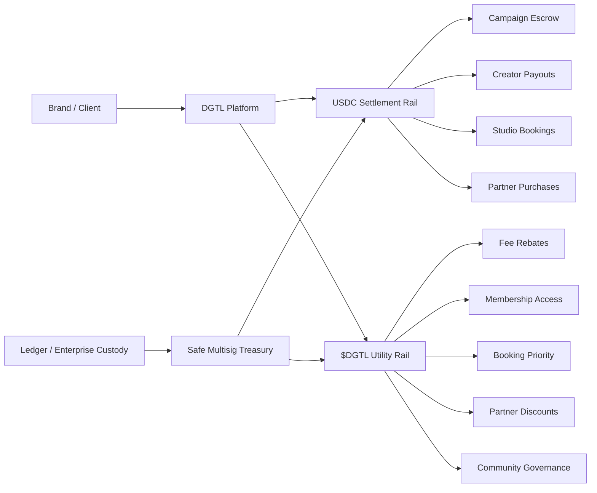

> **SUPERSEDED — archived v1.** This document is the original concept. It is replaced in full by
> [`docs/DGTL-Pay-Strategy-v4.md`](../DGTL-Pay-Strategy-v4.md), which is canonical.
> Kept for reference only — do not act on anything below without checking it against v4.

---

# DGTL Token Strategy Report

## Strategic fit for the DGTL concept

DGTL’s idea is strongest when it is framed as an **ecosystem utility and settlement-adjacent product** for creator commerce, not as a proxy for company equity. The practical, defensible use cases are platform access, studio bookings, service discounts, campaign escrow, creator rewards, partner redemptions, and governance over community features or grant programs. Those uses fit the way mainstream token standards are normally used, and they also align with how the EU’s MiCA framework describes utility tokens that grant access to goods or services and require clear disclosure of rights and redemption mechanics. citeturn0search1turn21view3

The commercial pain point you identified is real: cross-border payments are still often slower, costlier, less transparent, and less accessible than domestic payments, even though SWIFT gpi has materially improved bank-transfer performance in many corridors. At the same time, official research is increasingly explicit that **payment stablecoins** could reduce some intermediary frictions in cross-border payments. That means the market gap exists, but the best answer is usually **not** a volatile proprietary token acting as the unit of account for payroll and vendor settlement. citeturn5search0turn22view2turn24view1

That leads to the central conclusion of this report: **DGTL should be built as a dual-rail system**. Use a stable digital dollar such as USDC for invoicing, cross-border payouts, subscriptions, and treasury accounting; use **$DGTL** for utility, incentives, access, discounts, staking-like membership mechanics, and ecosystem coordination. Circle supports USDC across both Base and Solana contexts, and Base’s payment tooling is explicitly built around fast USDC payments and recurring charges. Meanwhile, FINRA continues to warn that crypto assets are often extremely volatile and less liquid than traditional assets. citeturn23view0turn23view1turn21view5turn32view0turn22view3

The most important strategic change from your draft concept is this: **remove every suggestion that the token is “almost like an investment share.”** U.S. SEC materials now say plainly that even a crypto asset that is not inherently a security can still become subject to securities law if it is offered and sold as part of an investment contract, and the SEC specifically highlights the importance of the project team’s promises and representations. In other words, the economic reality and the marketing matter more than the label. citeturn21view0turn21view1

## A token model that matches DGTL’s business

The most workable design for DGTL is a **three-layer model**.

The first layer is the **settlement rail**. This is where brands pay campaign invoices, where creators receive cross-border payouts, where studio bookings are settled, and where enterprise partners clear larger transactions. This rail should be denominated in **USDC**, not in $DGTL, because corporates and creators need price stability, auditable accounting, and faster reconciliation. Base’s payment stack is built for USDC payments and subscriptions, and Solana plus Circle also support USDC-native flows. citeturn21view5turn32view0turn32view1turn23view1turn23view2

The second layer is the **DGTL utility token**. This token can still be meaningful and valuable, but its value proposition should come from **platform demand**, not from an implied claim on DGTL corporate upside. The token can power booking priority for DGTL Studios V2, fee rebates for brands using the creator network, discounts on equipment or services, gated access to premium distribution tools, community voting on creator funds or grants, reward points for recurring users, and optional token-based gas sponsorship or app perks. Standard ERC-20 tokens are commonly used for exchange, voting, staking, and similar utilities; Base’s newer B20 standard adds built-in roles, caps, policy gating, memos, and other administrative tooling; Solana’s token extensions add metadata, transfer fees, and permissioning options. citeturn0search1turn21view6turn27view0turn21view7turn22view6turn22view7

The third layer is an **enterprise policy layer**. This is where DGTL can support corporate campaign flows, regulated counterparties, whitelisted treasury wallets, or partner-specific redemption rules. On Base, B20 includes transfer policies, freeze-and-seize, role-based access control, memos, and supply caps as native features. On Solana, Token ACL enables allowlists and blocklists, while token extensions can support permanent delegation and transfer-fee configurations. The key architectural insight is that you do **not** need to impose those controls on every retail user if you separate consumer utility from enterprise settlement controls. citeturn27view0turn22view7turn27view2turn22view6

Your proposed **3:1 cash-value offer** needs to be redesigned. Whatever the precise mechanics, a standing promise that token compensation is worth materially more than cash greatly increases the chance that recipients treat the token as a speculative asset rather than a utility. It also creates accounting, treasury, and market-structure problems if the internal valuation diverges from public market price. For U.S. recipients, digital assets received for services are ordinary income measured at fair market value when received, employee payments can trigger withholding and wage-reporting obligations, and using digital assets to pay for services can also be a taxable disposition by the payer. A safer structure is a **limited compensation menu**: cash only, cash plus token bonus, or token-heavy compensation subject to preset valuation rules, caps, vesting, and written election by the recipient. citeturn22view0turn21view0turn22view3

In practical terms, the most defensible compensation design is this: offer creators and contractors **optional token participation**, price the token using a clearly disclosed methodology such as a trailing VWAP or board-approved treasury reference price, and apply lockups or progressive unlocks for larger token-heavy packages. Do not imply that the token tracks DGTL corporate value, and do not describe the choice as “buying into the company” unless you are prepared to build a fully regulated securities structure instead. The SEC’s current position and Coinbase’s own listings guidance both make clear that public statements, whitepapers, and marketing language directly affect regulatory and listing risk. citeturn21view0turn26view0

A more coherent product message would be: **USDC moves the money; $DGTL unlocks the network.** That single sentence is strategically stronger, easier to explain to brands, easier to defend to counsel, and easier to list on mainstream venues than a narrative built around anti-bank ideology or quasi-equity language. Base and Circle’s documentation already support the fast-USDC-payment side of that proposition. citeturn21view5turn32view0turn23view1

## Regulatory architecture and the real compliance perimeter

The most important legal reality is that **being incorporated outside Canada or outside any one country does not remove obligations where users, customers, or marketing are located**. FinCEN states that persons accepting and transmitting value that substitutes for currency, such as convertible virtual currency, are money transmitters, and that these requirements apply equally to domestic and foreign-located businesses doing business in whole or substantial part within the United States, even without physical U.S. presence. MiCA applies to persons issuing, offering, admitting to trading, or providing crypto-asset services in the European Union. The FCA says firms must register before providing certain cryptoasset services in the course of business in the United Kingdom. citeturn21view2turn21view3turn23view4

That means DGTL needs a **market-by-market legal map**, not a single offshore-company assumption. If DGTL lets brands fund creator payouts, transmits value between counterparties, offers custody-like flows, or operates exchange-like or payment-like services, then the risk shifts from “token issuer” toward “financial intermediary.” FATF’s framework is explicit that countries should assess and mitigate risks tied to virtual-asset activity, and license or register providers that fall inside those activities; the guidance also specifically addresses stablecoins and travel-rule implementation. citeturn24view0turn18search2turn18search4

The securities-risk perimeter is also clear. The SEC now says that crypto assets can become subject to federal securities law when offered and sold as part of an investment contract, and it emphasizes the relevance of the project team’s promises and representations. MiCA likewise expects offerors to publish public white papers and marketing communications in advance, and for utility tokens it specifically contemplates disclosure of the goods or services the token grants access to and how those tokens can be redeemed. So the safest path is not “call it a utility token”; it is to **design and present it like a real utility token**. citeturn21view0turn21view3turn23view5

For DGTL, that means the following are **high-risk and should be avoided** unless formal securities counsel tells you otherwise: language about “investment shares,” corporate upside, company-linked appreciation, profit participation, revenue sharing, treasury-managed token price support, buying in before growth, or token purchases framed around expected gains from DGTL management’s efforts. It also means founders and creators need strict communication rules, because Coinbase’s own listings guidance now says that public statements can materially affect the regulatory risk profile of a token. citeturn21view0turn26view0

Your creator network adds another layer: **influencer endorsement law**. The FTC says endorsement claims must be truthful and not misleading, and if there is a connection between the endorser and the marketer that would affect how people evaluate the endorsement, that connection should be disclosed. FTC guidance for social media influencers says this applies to financial relationships, including free or discounted products or anything of value, and that U.S. law can apply even to posts made from abroad if it is reasonably foreseeable that they will affect U.S. consumers. If creators are paid in tokens to talk about DGTL, the payment itself is the kind of material connection that must be disclosed. citeturn30view0turn30view1

The upshot is that DGTL should launch with a **compliance perimeter by design**. That means: a formal token rights memo, standardized creator compensation elections, KYC/AML partner selection for any payout or conversion flows, sanctions screening, territory gating where necessary, a marketing review process for founders and influencers, and a jurisdiction matrix that answers a simple question for every market: “Can we market, sell, custody, transmit, or pay out here ourselves, or must we use a licensed partner?” FATF, FinCEN, MiCA, FCA, and FTC materials all point in the same direction: the operational model matters as much as the token code. citeturn24view0turn21view2turn21view3turn23view4turn30view1

## Technical and operational architecture

The most practical chain recommendation for DGTL is **Base first, Solana second**.

Base is the better first deployment if DGTL’s early priority is **business payments, creator onboarding, subscriptions, and EVM ecosystem compatibility**. Base is EVM-compatible, its documentation supports USDC payments and recurring subscriptions, it supports ERC-20 gas payment patterns, and its newer B20 token standard has native features that map unusually well to business use cases such as memos, policy gating, supply caps, and role-based controls. Those features are directly relevant to studio bookings, invoice references, corporate campaign spend controls, and treasury operations. citeturn0search2turn21view5turn24view2turn32view0turn21view6turn27view0

Solana becomes attractive when DGTL wants **high-throughput consumer payments or native token controls without as much custom contract work**. Solana’s mint model is straightforward, and its token extensions explicitly support enterprise-style behaviors such as transfer fees, permanent delegation, native metadata for payment reconciliation, and permissioned token controls via Token ACL. That makes Solana especially strong for specialized payment or enterprise tokenization features. citeturn27view1turn21view7turn22view6turn27view2turn22view7

My recommendation is therefore not “pick one forever,” but **phase the architecture**. Start with Base because it is the better fit for a creator-commerce platform that needs payment UX, subscriptions, and Ethereum tooling. Add Solana later only if you need native transfer-fee mechanics, richer permissioned-token flows, or a second-chain distribution strategy. Circle supports both Base and Solana contexts, and CCTP support across chains gives you an official route for moving USDC between supported networks. citeturn23view0turn23view1turn23view2

A workable architecture looks like this:

On the treasury side, DGTL should use a **multisig** from day one. Safe describes multisig security as threshold-based approvals that remove the single-signature point of failure, and that is exactly what DGTL needs for mint authority, treasury wallets, liquidity provisioning, and vesting releases. If DGTL intends to transact with larger counterparties or hold material balances, Ledger Enterprise’s positioning around hardware-backed protection and policy-driven control is also aligned with this use case. citeturn22view4turn22view5

On the contract side, the minimum production stack should include a **token contract**, **vesting and lockup contracts**, a **treasury multisig**, a **payout/escrow module**, and a **payments integration layer**. If you stay on standard ERC-20, OpenZeppelin remains the safest default library family because its token and access-control patterns are widely adopted. Its own documentation specifically notes that access control can govern minting, voting, and transfer restrictions, which maps directly to DGTL’s need for tightly scoped admin powers. citeturn0search5turn23view3

The key operational design choice is to keep **most real money movement on the USDC rail**, not the DGTL rail. DGTL can still be accepted as a payment option for selected platform uses, and Base even supports custom ERC-20 gas-payment patterns, but the accounting center of gravity should remain the stablecoin rail. That makes it easier to invoice, easier to reconcile, easier to communicate to corporate partners, and easier to keep the token’s story focused on utility rather than speculation. citeturn21view5turn24view2turn32view0

## Liquidity, public trading, and exchange strategy

A public market should be treated as **phase two or three**, not as the launch itself.

The first tradable venue for DGTL will almost certainly be a **DEX**, because DEX listing is permissionless: a pool exists once someone creates the pair and seeds liquidity. Uniswap’s documentation is very clear that a liquidity pool begins with zero balances, the first liquidity provider seeds both assets, and that first provider effectively sets the opening price by depositing equal value of each token. That makes DEX listing mechanically simple, but it also means a reckless initial price or thin liquidity can damage the project immediately. citeturn24view3

CEX listing is a completely different process. Coinbase says applications are free and merit-based, but the exchange reviews legal, compliance, and technical security issues, along with market demand, holder traction, TVL, onchain activity, and public statements. Coinbase also now says listing timelines can range from hours to months depending on complexity and the quality of the submission, and that marketing language can become a roadblock. Kraken similarly asks for the project’s mission, technical specifications, tokenomics, and team, and then evaluates security, regulatory posture, liquidity potential, and market fit before legal and engineering integration. citeturn21view8turn26view0turn21view9

That means DGTL should not think in terms of “how do we get listed?” first. It should think in terms of **“how do we become listable?”** The answer is a listing data room with the following components already prepared: white paper, token rights summary, legal memos for target markets, audited code, source repositories, block explorer verification, treasury and vesting disclosures, holder allocation tables, governance model, sanctions/KYC policy summaries, and evidence of real platform usage. Coinbase now explicitly references whitepapers, team background, tokenomics, source code, block explorers, and third-party audits in its application flow. citeturn26view0

The more subtle issue is market quality. If DGTL’s first months are dominated by token-forward compensation offers and thin public liquidity, the token may look like an incentive scheme rather than a functioning platform asset. A better sequence is:

First, launch the platform utility and **closed payment pilots**.  
Then, open **limited DEX liquidity** once real redemptions and use cases exist.  
Only after that, pursue **CEX applications** when there is evidence of demand, real holders, redemption activity, and stable operational controls. citeturn24view3turn26view0turn21view9

There is also a messaging point here. If DGTL wants corporate partners such as hardware wallet or custody brands in the future, those firms will care more about governance, security, compliance, and actual business usage than about anti-establishment rhetoric. Ledger’s enterprise positioning is explicitly about institutional custody, workflows, control, and governance. That is the language that wins partnerships. citeturn22view5turn8search6

## An implementation roadmap for DGTL

The first phase should be **legal and product definition**, not token minting. In this phase, DGTL should choose the target launch rail, define the token rights with outside counsel, prohibit share-like language, decide where token payments are allowed, write creator compensation templates, and define how the company will avoid acting as an unlicensed transmitter where that risk exists. This phase should also decide whether DGTL is launching a standard ERC-20 on Base, a B20 token on Base, or a Base-first model with Solana reserved for a later enterprise extension. The choice depends on whether wallet/exchange compatibility or native policy tooling matters more at launch. citeturn21view6turn27view0turn24view0turn21view2turn21view3

The second phase should be a **closed beta financial layer**. Deploy on testnet first, set up Safe multisig treasury controls, integrate Ledger-backed signing or enterprise custody where appropriate, and pilot only the stablecoin settlement rail with a small number of trusted brands and creators. Base’s documentation supports this path unusually well because it already covers USDC payments, recurring subscriptions, and ERC-20 gas abstractions. In this phase, $DGTL should exist, but it should primarily function as a controlled reward and access asset, not a public trading instrument. citeturn0search14turn21view5turn32view0turn24view2turn22view4turn22view5

The third phase should be a **utility activation phase**. This is where DGTL turns on the token’s real product hooks: studio booking credits, partner discounts, membership tiers, creator loyalty rewards, rebate schedules for brands, and governance over a community treasury or creator fund. If DGTL cannot show that token holders are using the token for something besides resale, the project will have a weaker regulatory story and a weaker exchange story. MiCA’s utility-token framing and Coinbase’s focus on real-world usage both support this sequencing. citeturn21view3turn26view0

The fourth phase should be the **public market and partner phase**. Only after the token has functioning utility, verifiable redemptions, transparent tokenomics, and clean operating controls should DGTL seed public liquidity and begin exchange applications. At that stage, the pitch becomes much more coherent: DGTL is not selling an abstract vision of rebellion against traditional finance; it is operating a creator-commerce financial layer with measurable settlement activity, service redemptions, and partner integrations. citeturn24view3turn21view8turn21view9

If I were turning your concept into a board-level action plan, the top-line recommendation would be this: **build DGTL as a creator-commerce network with stablecoin settlement and tokenized utility, not as a corporate-surrogate currency.** That preserves the sovereignty narrative, solves a real operational problem, reduces volatility risk for users, improves the odds of legal defensibility, and gives DGTL a far better shot at exchange readiness and institutional partnerships. The underlying official materials from payment, regulatory, exchange, and blockchain infrastructure sources all support that direction. citeturn24view1turn21view2turn21view3turn26view0turn21view9turn21view5turn21view7