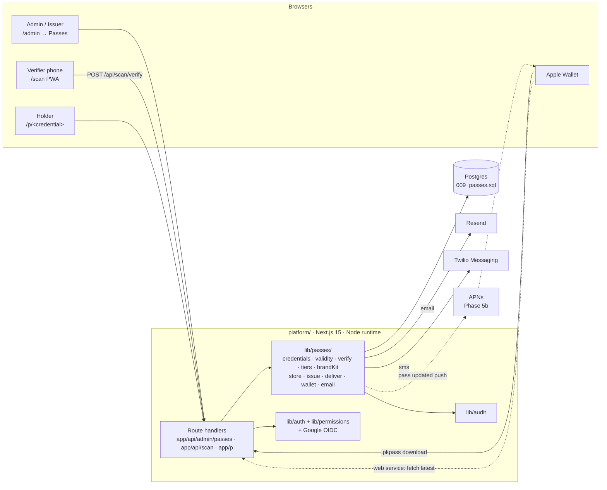
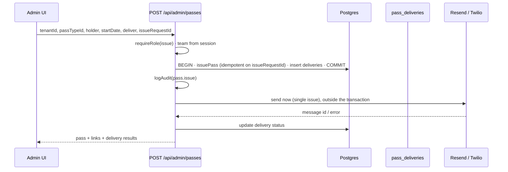
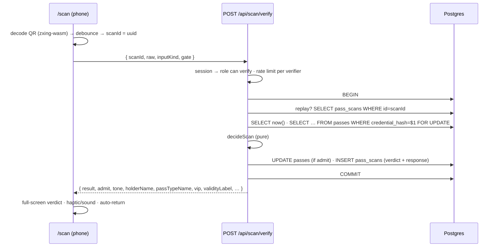

# 02 · Architecture

## The decision: a platform module, not a new app

DGTL Pass is built **inside `platform/`** as a module: `lib/passes/`, new routes, a ninth admin
tab and a `/scan` page. It is **not** a standalone Next.js + Supabase app.

The first-draft plan this package replaces proposed Supabase Auth + Postgres + RLS as a separate
stack. That would have rebuilt things the platform already runs in production:

| Need | Already in `platform/` | Supabase plan would have… |
|---|---|---|
| Multi-tenant brand config | `tenants` + `brand` config, draft/publish, media library | a second `brand_kits` table and editor |
| Staff, teams, roles | `users`, `teams`, `team_memberships`, `lib/permissions.js` | a second user store and role model |
| Sessions | `sessions` + hashed cookie tokens (`lib/auth.js`) | Supabase JWTs next to platform cookies |
| Audit | `audit_logs` + `lib/audit.js` | a second audit trail |
| Email | Resend seam with dry-run (`lib/integrations/emailProvider.js`) | a second Resend integration |
| SMS | `twilio` already a dependency (telephony) | a second Twilio setup |
| Selling passes later | Stripe checkout + webhook fulfilment (`lib/payments/stripe.js`) | a second Stripe integration |
| Admin UI | DGTL-branded tabbed shell | a second admin |

Splitting the customer record (holder) from the lead and the tenant across two databases would also
block the product sequence in CLAUDE.md, where funnels feed leads, leads feed checkout, and
checkout feeds passes. Precedent in the decision log points the same way. ON Home Decor was
migrated *into* the platform, and enterprise prospecting *extends* modules rather than forking
them. The 2026-08-13 decision makes the platform the system of record and refactors it
"incrementally into routed modules", while flagging `admin/page.jsx` and `lib/store.js` as
over-centralised. So Passes is built as a **routed module**. It has its own `lib/passes/store.js`
(nothing added to `lib/store.js`), its own API routes, and a panel that fetches its own data (no
new queries in `admin/page.jsx`).

**What this costs, and the answers:**

| Cost | Answer |
|---|---|
| The platform is JavaScript (JSX, JSDoc), not TypeScript | Follow the house style; pure functions + tests carry the correctness |
| No RLS | Same app-layer team scoping as every other module, proven by isolation tests (below) |
| No OAuth today | Add Google OIDC to the existing session system ([10-auth-and-roles.md](10-auth-and-roles.md)) |
| The stabilise priority | Phase 0 makes the release gate required *before* this lands ([13-build-plan.md](13-build-plan.md)) |

**Alternatives considered:**

- **`apps/dgtl-pass/` standalone.** Rejected. CLAUDE.md forbids `apps/` importing from
  `platform/`, so it would re-implement auth, tenancy, email and audit. Apps are for products
  deliberately separate from the platform, like DGTL OS. Passes are a platform capability tenants
  switch on.
- **A third-party pass platform (PassKit, Passcreator, Airship).** Rejected for the core. It puts a
  per-pass fee and a vendor between DGTL and the product it is trying to sell. A reasonable
  fallback for Google Wallet later.

## System map



There are no new services, no queue infrastructure and no Redis. The delivery queue is a table
drained by a cron-called route, the same pattern as `/api/cron/outreach/drain`. When traffic
justifies it, `lib/passes/` is already the boundary to lift out.

## Module layout (target)

```
platform/
  migrations/009_passes.sql                  ← from migration/ in this package
  lib/passes/
    credentials.js    validity.js    verify.js     ← reference/ (port as-is)
    tiers.js          brandKit.js                  ← reference/ (brand.js → brandKit.js)
    store.js          ← reference/repository.js: issuePass, verifyScan, revokePass + list/query helpers
    issue.js          ← orchestration: store.issuePass → enqueue deliveries → audit
    deliver.js        ← render + send one delivery; drainDueDeliveries() for cron
    holders.js        ← validation, consent state, E.164 normalisation
    passTypes.js      ← CRUD + preset instantiation + validation
    metrics.js        ← overview counts (derived status, SQL)
    email/render.js   email/copy.js                ← reference/email/ (port as-is)
    wallet/passJson.js                             ← reference/passJson.js
    wallet/pkpass.js  ← passkit-generator: images + sign + zip
    wallet/service.js ← Apple web service handlers (Phase 5b)
    images.js         ← QR PNG (qrcode) + Code 128 PNG (bwip-js)
    config.js         ← env parsing: secrets, base URL, allowed hosts, Apple config
  lib/integrations/
    sms.js            ← provider seam (mock | twilio), mirrors emailProvider.js
    twilioSms.js
  lib/auth/google.js  ← OIDC start/callback helpers (or lib/oauth.js)
  app/
    admin/page.jsx                 ← + "passes" tab panel
    scan/page.jsx  scan/layout.jsx ← PWA shell (own manifest scope)
    p/[credential]/page.jsx        ← holder pass page
    p/[credential]/qr.png/route.js      p/[credential]/barcode.png/route.js
    p/[credential]/wallet.pkpass/route.js
    api/admin/passes/…  api/admin/pass-types/…  api/scan/verify/route.js
    api/auth/google/start/route.js  api/auth/google/callback/route.js
    api/cron/passes/drain/route.js
    api/wallet/v1/…                 ← Phase 5b
  components/admin/passes/…        ← PassesPanel, IssuePassForm, PassTable, PassDrawer, PassTypeEditor, ScanLog
  components/scan/…                ← Scanner, VerdictScreen, ManualEntry
  tests/passes-*.test.js
```

Conventions to keep (from the existing codebase):

- Admin mutation routes take ids **in the body**, not dynamic `[id]` segments (decision log
  2026-06-29). `/p/[credential]` is a public URL scheme and must be a dynamic segment. Await
  `params` there (Next 15).
- Every admin route: `requireRole(...)` → team from session → team-scoped query → `logAudit(...)`
  with `metadata.teamId` → `permissionDeniedResponse` on error.
- Integrations degrade: no `RESEND_API_KEY` means sends are recorded as "not configured", and a
  dry-run flag sends through the mock provider. No Apple cert means the Wallet button is hidden,
  not broken.
- Off-default admin panels load via `components/admin/lazyPanels.jsx` (`ssr:false`).
- Styling: admin panels use `dgtl-admin.css` tokens. The scanner and pass page get their own
  small token sheet, derived from the tenant brand kit at request time and never hardcoded.

## Request flows

### Issue & send



A single issue sends inline so the admin sees the result. Bulk issue only enqueues, and
`/api/cron/passes/drain` sends in batches with a compare-and-set claim (the `claim_token` column,
same design as the outreach queue). A provider failure never rolls back the pass. The admin sees
"email failed, retry", and the pass still works from its link.

### Scan



Details and the proofs are in [05-verification.md](05-verification.md).

### Holder pass page and Wallet

`GET /p/<credential>` → normalise → hash → look up → render with the tenant brand kit. Unknown
credentials get a plain 404, identical for "never existed" and "rotated". The page sets
`noindex`, `no-store` and `Referrer-Policy: no-referrer`. The first view stamps
`passes.first_viewed_at`, which is the VIP "accept" metric. `…/wallet.pkpass` builds and signs on
demand (no stored files) and returns `application/vnd.apple.pkpass`.

## Hosts and URLs

- **Pass host:** `PASS_PUBLIC_BASE_URL`, served by the same platform container. The QR encodes
  `<base>/p/<credential>`, so **this host is permanent the moment the first real pass ships.**
  A later move must keep the old host in `PASS_ALLOWED_SCAN_HOSTS` and redirect it. Recommended:
  `https://pass.dgtlmag.com`, a subdomain of the live app domain, one Coolify/Traefik label.
  Confirm before Phase 2 ([15-config-and-accounts.md](15-config-and-accounts.md)).
- **Per-tenant vanity hosts** (`pass.<tenant>.com`) are roadmap. The resolver already accepts a
  list, so adding one is config, not code.
- **Scanner:** `<app host>/scan`. It can be the pass host too. Keep it on the same origin as
  `/admin` so the session cookie is shared.

## Performance budget

| Path | Budget | How |
|---|---|---|
| `/api/scan/verify` server time | p95 < 120 ms | One indexed lookup by unique `credential_hash`; one row lock; one insert |
| Scanner decode | < 250 ms per frame on a 2020 iPhone | zxing-wasm in a Web Worker, 640-px frames, QR + Code 128 only |
| `/p/<credential>` | TTFB < 300 ms | Server-rendered, no client JS beyond the brightness hint |
| `.pkpass` build | < 400 ms | In-memory, images cached per pass type |
