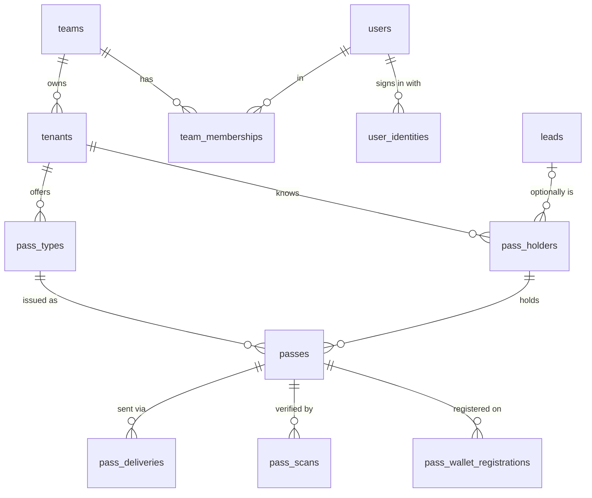
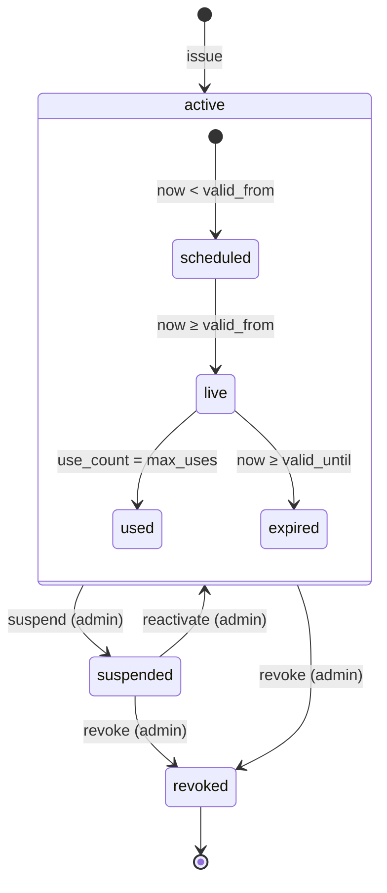

# 03 · Data model

The full DDL is [`migration/015_passes.sql`](migration/015_passes.sql). It applies cleanly on top
of `platform/migrations/001–014` and is idempotent. Both are proven by
[`reference/repository.test.js`](reference/repository.test.js).

## Entities



| Table | Purpose | Key constraints |
|---|---|---|
| `team_memberships` *(altered)* | + roles `issuer`, `verifier` | role check constraint replaced |
| `users` *(altered)* | `password_hash` nullable for OAuth-only staff | — |
| `user_identities` | Google (later Apple/Microsoft) subject ↔ user | `unique (provider, subject)` |
| `pass_types` | A tenant's catalogue entry | `unique (tenant_id, slug)`, tier/validity checks, lifetime only on VIP/custom |
| `pass_holders` | The person a pass is issued to, plus consent state | `unique (tenant_id, lower(email))`, email or phone required |
| `passes` | One credential; the verification source of truth | `credential_hash` unique, `unique (team_id, short_code)`, `issue_request_id` unique, `use_count ≤ max_uses`, `valid_until > valid_from` |
| `pass_deliveries` | Every email/SMS attempt; also the bulk queue | status + claim token (CAS) |
| `pass_scans` | Append-only verification ledger; also the scan idempotency store | primary key = client scan id; stores the returned response |
| `pass_wallet_registrations` | Apple Wallet devices for push updates (Phase 5b) | `unique (device_library_id, pass_id)` |

Every business table carries `team_id` (the security boundary) and `tenant_id` (the brand).
Queries filter on `team_id` from the session, never from the request body.

## Pass lifecycle

Stored `passes.status` has three values. Everything else is derived at read time by
`effectiveStatus(pass, now)` in [`reference/verify.js`](reference/verify.js):



There is no cron job to flip `expired` or `used`. They cannot drift from the truth because they
*are* the truth: the window and the counter. Dashboards compute them in SQL:

```sql
-- effective status in SQL, for list filters and overview counts
case
  when p.status in ('revoked', 'suspended') then p.status
  when now() < p.valid_from then 'scheduled'
  when p.valid_until is not null and now() >= p.valid_until then 'expired'
  when p.max_uses is not null and p.use_count >= p.max_uses then 'used'
  else 'active'
end
```

## Invariants (and where each is enforced)

| # | Invariant | Enforced by |
|---|---|---|
| I1 | A credential resolves to at most one pass | `credential_hash unique` |
| I2 | A pass is never admitted more times than `max_uses` | row lock in `verifyScan` **and** `check (use_count <= max_uses)` |
| I3 | A double-submitted issue form creates one pass | `issue_request_id unique` + replay lookup |
| I4 | A double-submitted scan admits once and returns the same verdict | `pass_scans.id` = scan id + stored `response` |
| I5 | Editing a pass type never changes an issued pass | window + `max_uses` + cooldown snapshotted onto `passes` |
| I6 | A verifier can only ever read their own team's passes | `decideScan` team check; short-code lookup filtered by `team_id` in SQL |
| I7 | A pass type can only issue within its own team and tenant | `issuePass` selects the type by `(id, team_id, tenant_id)` |
| I8 | The credential is never stored | only `credential_hash` + `credential_key_id` + `credential_version` are persisted |
| I9 | A pass's window is well-formed | `check (valid_until is null or valid_until > valid_from)` |

## Why passes are Postgres-only

The platform falls back to a JSON file store when `DATABASE_URL` is unset. **Passes do not.**
Atomic redemption needs row locks and transactions, and the file store has a known unserialised
read-modify-write race (Known Issues: "file-store write race", HIGH). A double scan against it
could admit twice. Without Postgres the Passes module renders "Passes need a database — set
`DATABASE_URL`", and `/api/scan/verify` returns 503. Tests use PGlite (in-process Postgres) for
the SQL, plus one real-Postgres concurrency test in CI ([14-test-plan.md](14-test-plan.md)).

## Tenant config additions (not a table)

Brand, sender and legal identity are **tenant config**, validated by `lib/tenantValidation.js` and
edited through the existing tenant editor with draft/publish. This follows "tenants are config"
(CLAUDE.md). Resolved by [`reference/brand.js`](reference/brand.js) `resolveBrandKit`:

```js
passes: {
  enabled: true,
  timeZone: "America/Toronto",       // IANA; required when enabled
  dayCutoffHour: 0,                  // 0–12; 4 = nightlife business day
  brandKit: {
    theme: "dark",                   // "dark" (DGTL ladder) | "light"
    name: "", logoText: "",          // default from brand.name / brand.logoText
    logoUrl: "",                     // https PNG for email + Wallet (media library asset URL)
    logoIncludesName: false,         // true when the logo spells the name (the DGTL wordmark)
    colors: { accent: "", background: "", surface: "", surfaceRaised: "", line: "", text: "", textMuted: "", textDim: "", kicker: "" },
    sender: { fromName: "", fromEmail: "", replyTo: "" },
    legal: { postalAddress: "", supportEmail: "", supportUrl: "", termsUrl: "" }
  },
  vipOffer: { title: "", body: "", code: "", expiresAt: "", terms: "" },  // default onboarding offer
  sender: { name: "", title: "" }    // onboarding sign-off
}
```

Every key is optional except `timeZone` and `legal.postalAddress`. Without the postal address,
**sends are blocked**, because sender identification is a compliance requirement
([08-messaging.md](08-messaging.md)). The admin sees exactly which field is missing.

## Retention

| Data | Kept | Note |
|---|---|---|
| `passes`, `pass_holders` | While the tenant is active | Holder erasure request: anonymise name/email/phone, keep the pass row + ledger with `holder_id` pointing at the anonymised record |
| `pass_scans` | 24 months, then aggregate | IP stored only as a daily-salted hash |
| `pass_deliveries` | 13 months | Provider message ids for dispute handling |
| `audit_logs` | Platform policy | Unchanged |
